# How QTM works: an end-to-end guide to New Nintendo 3DS head tracking

This document describes the QTM system module in the supplied `n3ds_qtm_latest.i64` process-memory image. It combines the investigation's architectural, algorithmic, format, calibration, service and lifecycle findings into one explanation. Function names such as `Tracker_BuildMotionCandidate` are descriptive names assigned during reverse engineering, rather than authenticated original symbols. Addresses refer to this particular image; its exact firmware revision has not been independently identified.

The main path is camera image → face detection → two eye positions → temporal tracking and gyro compensation → prediction → calibrated barrier phase → expander output. QTM also controls infrared illumination and serves tracking data to clients. The algorithms recover eye **positions**, not identity, gaze direction or a fresh measurement of head depth.

Mathematical formulas below explain the operations. Where exact reproduction matters, the text also specifies integer widths, rounding and operation order. All discussion of how findings were obtained, tested and qualified is collected in [Reverse-engineering and verification](#verification).

## Contents

1. [What the module does](#overview)
2. [The mathematics and vision vocabulary](#foundations)
3. [Startup, camera capture and timestamps](#capture)
4. [Turning camera bytes into useful images](#images)
5. [LBP: deciding whether a region resembles a face](#lbp)
6. [Searching the image and choosing a face](#search)
7. [SDM: refining the two eye positions](#sdm)
8. [Optical flow: carrying a face between images](#flow)
9. [The complete image-frame state machine](#frame)
10. [From raw gyro samples to camera-motion estimates](#gyro)
11. [Learning short-term image motion](#learning)
12. [Histories and the two prediction paths](#prediction)
13. [Calibration and eye position to barrier phase](#calibration)
14. [Driving the parallax barrier](#barrier)
15. [Automatic and manual infrared illumination](#ir)
16. [IPC commands and public tracking coordinates](#ipc)
17. [A complete tracking/loss/recovery walkthrough](#walkthrough)
18. [Lifecycle, storage and configuration](#lifecycle)
19. [Numerical behavior, structures and function map](#implementation)
20. [Reverse-engineering and verification](#verification)

---

<a id="overview"></a>
## 1. What the module does

A parallax barrier directs different screen columns toward different viewing directions so that the two eyes see different images. Moving the viewer sideways changes the required alignment. QTM estimates where the eyes will be and chooses among twelve cyclic barrier phases. Two additional presets provide transparent/2D and static-3D output.

The camera gives direct visual information, but images arrive relatively slowly and processing takes time. The gyro measures rotation of the console. It cannot directly measure the viewer's head motion, but it helps distinguish apparent image motion caused by console rotation and propagate an earlier visual estimate between images. Short-term learned image-motion predictors supply the remaining extrapolation.

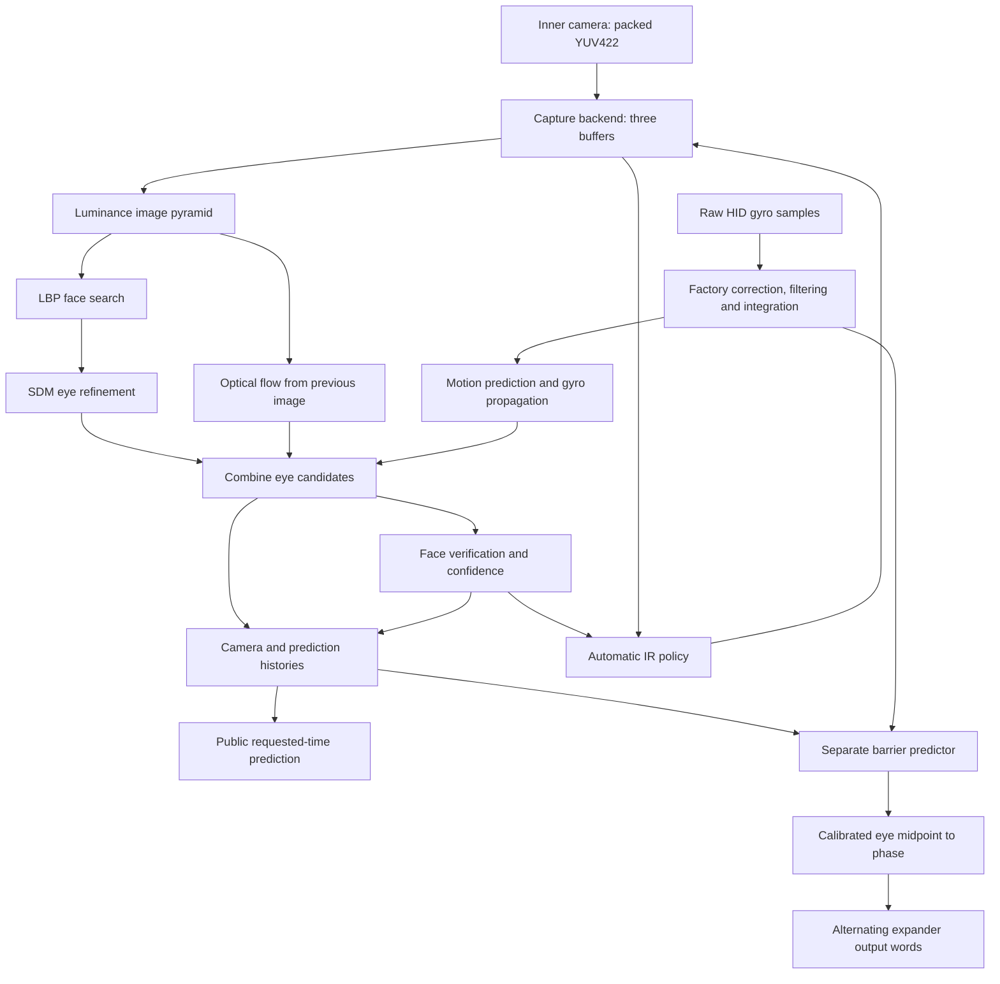

The picture is a data-flow summary, not a strict call-order diagram. In particular, some history publication occurs **before** that frame's verification. The [frame chapter](#frame) gives the actual order.

### Several independent clocks and workers

| Component | Job | Timing represented in the software |
| --- | --- | --- |
| Main/service threads | IPC, service sessions and system notifications | Request/event driven |
| Camera capture backend | Camera service events, receives, buffer ownership, vsync IR bookkeeping | Camera event driven |
| Camera processing worker | Image algorithms, history publication and IR policy | Production target 30 FPS |
| Gyro/barrier worker | Read inertial batches, predict eyes, publish barrier phase | Sample/event driven; one 15 ms wait and retry after an empty read |
| Expander worker | Alternate output-register values, select barrier mode | Woken by publication/control events; normal wait has no timeout |

The tick frequency is **268,111,856 ticks per second**. The sampler's ordinary integration step is 0.01 seconds, corresponding to nominal 100 Hz inertial sampling. These facts do not establish a fixed 60 Hz tracking or barrier-output loop. A processing iteration may handle several gyro samples, and an empty batch can still precede a barrier publication.

### State values that must remain separate

| State domain | Values and meaning |
| --- | --- |
| Activation mode | 0: normal tracking/dynamic operation; 1: tracking with static barrier; 2: tracking suspended |
| Barrier control mode | 0: transparent; 1: static preset 13; 2: use stored phase |
| Image state | 0: Initialize; 1: Acquire; 2: Track; 3: Coast; 4: IR settling |
| Prediction mode | 0: gyro; 1: image motion; 2: combined; special mode 6 has caller-specific behavior |
| Automatic IR state | Off, TrialOn, TrackingOn, TrialOff |
| Camera IR metadata | 0: off; 50: transition; 100: on, as software bookkeeping |
| Confidence | A float, immediate and delayed gates, and a lost latch |

A successful IPC request is another separate concept. It means the request completed according to its Result policy; it does not mean a face was just found.

<a id="foundations"></a>
## 2. The mathematics and vision vocabulary

### Pixels, points and vectors

A grayscale pixel stores brightness. The usual image coordinate system has X increasing rightward and Y increasing downward. An eye position is a pair $p=(x,y)$; fractional coordinates are useful even though the source image has discrete pixels.

A vector can be read as an arrow. Subtracting two points gives the displacement between them. Adding a displacement moves a point. The eye midpoint is

```math
m=\frac{L+R}{2}.
```

The length of an arrow $(x,y)$ is $\sqrt{x^2+y^2}$. The dot product $a\cdot b=a_xb_x+a_yb_y$ measures alignment and appears when combining errors. A squared length avoids a square root when only relative magnitude is needed.

### Matrices are compact recipes for transforming coordinates

A 2×2 matrix contains four coefficients:

```math
M=\begin{bmatrix}a&b\\
c&d\end{bmatrix},\qquad
Mp=\begin{bmatrix}ax+by\\
cx+dy\end{bmatrix}.
```

Adding a translation $t$ gives an **affine transform**, $p'=Mp+t$. It can move, rotate, stretch or shear an image region. A **similarity transform** is the more restricted case of rotation, uniform scale and translation. Two distinct corresponding points can determine a 2D orientation-preserving similarity; three non-collinear pairs can determine an affine transform.

The **determinant**, $ad-bc$, is the signed area scale. A determinant near 1 means near-preserved area, but does not imply that every stretch or shear is small. A zero determinant means information has collapsed along some direction, so an ordinary inverse does not exist.

A 3×3 orientation matrix describes three spatial directions. Unit-length, mutually perpendicular rows are called **orthonormal**. The gyro sampler maintains such a matrix approximately, but the tracker consumes a separate cumulative-angle representation.

### Fitting, residuals and least squares

A fit chooses parameters that make predictions resemble observations. The difference between a predicted and observed quantity is its **residual**. Least squares chooses parameters to reduce a sum of squared residuals:

```math
E=\sum_i\|\text{predicted}_i-\text{observed}_i\|^2.
```

Squaring makes positive and negative errors contribute positively and gives larger errors more influence. A **weighted** fit multiplies different observations' contributions by different amounts. **Regularization** adds a preference for stable or plausible parameters when observations are weak or ambiguous.

QTM uses small matrix solves for geometric fitting, optical flow and adaptive prediction. These are different jobs, not one universal “AI confidence” calculation.

### Image pyramids and interpolation

A pyramid is the same image at successively smaller sizes. A large face in the original becomes a manageable patch at a smaller level. It also provides a way to sample over a larger area without reading every original pixel.

**Bilinear interpolation** estimates brightness between four neighboring pixels by blending horizontally, then vertically. **Trilinear sampling** here blends two bilinear samples from adjacent pyramid levels; it does not mean sampling a 3D camera image.

An **integral image** stores running rectangular sums. Once built, the sum over any rectangle can be computed from four corners. This makes comparisons between many brightness blocks inexpensive.

### What “learned” means here

The embedded model files contain parameters chosen before the module runs. A **classifier** answers a question such as “does this window resemble a face?” A **regressor** returns a numerical correction such as “move this eye estimate two pixels left.” Runtime use of these learned parameters is called inference.

QTM's recovered image pipeline uses local-feature classifier programs and landmark regression. It does not contain a neural-network inference stage in these paths. The model filenames do not reveal their complete training data, subject categories or vendor.

There is also runtime learning: the short-term motion filters adjust a few coefficients using recent observations. That is separate from training the embedded face and eye models.

### Smoothing, hysteresis and prediction

An exponential moving average, or EMA, updates a stored value toward a new observation:

```math
x_{\text{new}}=x_{\text{old}}+\alpha(y-x_{\text{old}}).
```

Small $\alpha$ gives persistence; large $\alpha$ reacts faster. **Hysteresis** uses different conditions for entering and leaving a state so that small fluctuations do not repeatedly switch it. **Prediction** estimates a future value; it is not the same as smoothing old observations.

QTM uses all three, for different purposes. Its confidence EMA, confidence gates, ten-frame loss transition, small-motion suppression and barrier phase hysteresis must not be merged into one filter.

### Number representations

Most numerical operations use **binary32**, the usual 32-bit `float`. Each operation rounds. Algebraically equal formulas can therefore produce different last bits when reordered.

A notation such as **Q13** means an integer represents a real value multiplied by $2^{13}$. For example, 8192 represents 1. Q16 intensity carries sixteen fractional bits; a source byte of 100 corresponds to roughly $100\times65536$. Fixed-point arithmetic allows interpolation and regression to use integer instructions.

**Wrapping** keeps only the low bits after integer overflow. **Saturation** instead returns an endpoint. QTM uses both in different places. Likewise, some decisions compare the raw bits of a float as a signed integer, rather than making a floating-point comparison. For ordinary nonnegative finite values these orderings often agree; exceptional values can behave differently.

<a id="capture"></a>
## 3. Startup, camera capture and timestamps

### Normal setup

Production initialization selects the inner camera, selector 2, port 1, size selector 1 and 320×240 packed YUV422 at a 30 FPS target. Each camera buffer holds $320\times240\times2=153{,}600$ bytes. Three buffers are allocated with 64-byte alignment.

The controller creates the camera, gyro sampler, tracker, calibration manager and IR policy. It selects prediction mode 2 and acquisition override 0. Model resources normally refer directly to the embedded archive. The live sampler is constructed without an accelerometer source.

The camera service configuration sends these headers in order. The numbered controls are deliberately named by their actual `cam:q` command rather than borrowing the meanings of similarly numbered commands on another camera interface.

| Order | Header | Data supplied |
| ---: | --- | --- |
| 1 | `0x001E00C0` | Camera selector, size selector, context 1 |
| 2 | `0x000E0080` | Port, trimming enabled |
| 3 | `0x00120140` | Port, output and capture dimensions |
| 4 | `0x000D0080` | Dimensions; obtain maximum transfer size |
| 5 | `0x000B0100` | Port, transfer size, dimensions |
| 6 | `0x00270080` | Camera selector, control value 1 |
| 7 | `0x00180080` | Camera selector, control value 1 |
| 8 | `0x001A0080` | Camera selector, control value 1 |
| 9 | `0x00130040` | Activate camera selector |

The software format setter also recognizes 640×480, 160×120 and 256×192, and has FPS-table entries 10, 15, 20, 30 and 60 mapped to camera enums 3, 0, 6, 8 and 5. This table alone does not establish the physical availability of every combination. The ordinary image algorithms described here use the 320×240 path.

### Three buffers, but no queue of every frame

The camera object tracks three indices:

- **Receive:** the buffer currently armed for the next transfer.
- **Published:** the most recently completed buffer.
- **Consumer:** the buffer held by image processing.

On receive completion, the backend publishes the old receive index, advances the receive index modulo three while skipping the consumer-held buffer, then arms another receive. A subsequent successful acquisition changes the consumer index to the published index, implicitly releasing the previous consumer buffer.

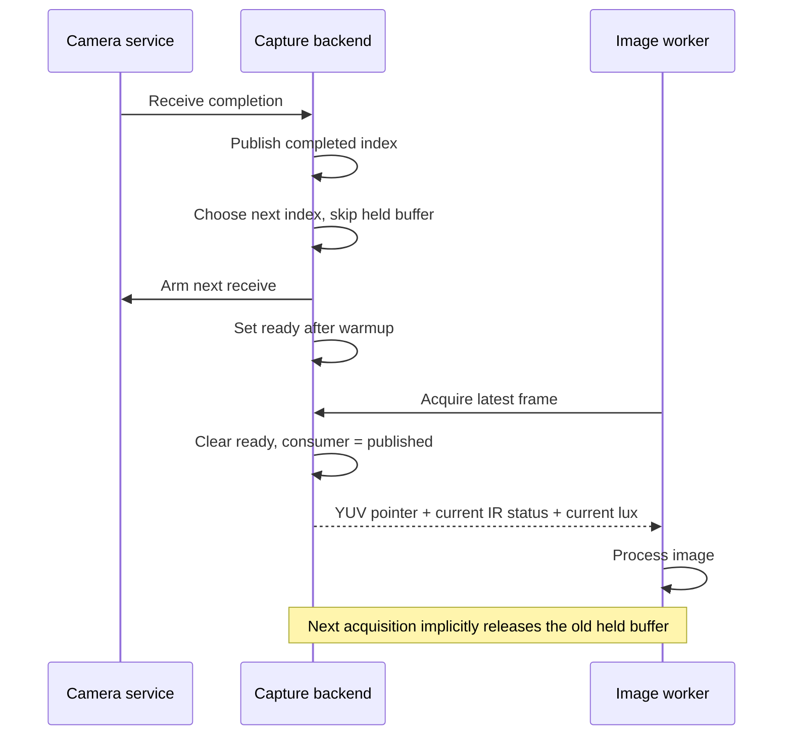

Readiness is a single latch. Several completed images can replace the published index while it remains set, so the consumer can skip intermediate frames. The backend withholds ready publication until ten startup vsync notifications have been counted. Reaching ten alone does not produce a frame; a later receive completion sets ready.

The returned 12-byte frame record contains a YUV pointer, signed IR metadata and lux. IR metadata and lux are shared values read at acquisition, not immutable metadata attached to each individual buffer. Their exact physical exposure association is therefore not encoded by the buffer index.

### Ownership events and coalescing

The capture backend waits on its QTM event and the replaceable receive-completion event. When another client owns the camera, it waits only on the QTM event. The QTM event query returns four counts whose handling corresponds to ownership restriction, ownership return, capture restart and vsync.

Ownership return is handled after restriction, so return wins if both counts are positive. Vsync is processed once per reported count. A coalesced event can advance several IR bookkeeping steps before the image worker acquires anything. A returned-ownership or resumed-pause path resets startup warmup and arranges capture restart.

Acquisition normally polls at 3 ms while no frame is ready. A ready frame has priority over abort/shutdown checks. Stop/drain polls capture busy with 1 ms sleeps, up to $\lfloor1000/\text{FPS}\rfloor+1$ sleeps, then clears the capture buffer. At 30 FPS this bound is 34 sleeps.

### Four timestamp concepts

| Timestamp | Meaning |
| --- | --- |
| Acquisition tick | System time sampled after a successful frame acquisition |
| Input tracker tick | Acquisition tick minus the configured camera delay |
| Selected frame tick | Tracker's optionally regularized version of that input |
| Prediction request tick | Time supplied to a public query or sampled by the barrier worker |

The default camera timestamp adjustment is **25 ms**, represented as

```math
\left\lfloor\frac{25\times268111856}{1000}\right\rfloor=6{,}702{,}796\text{ ticks}.
```

The live dispatcher subtracts it before calling the tracker. Controller/logging metadata retains the unadjusted acquisition tick. The offset is a software timing choice, not a measured exposure timestamp.

The live nominal frame interval is computed through float32 division and conversion, yielding **8,937,062 ticks at 30 FPS**. The no-camera fallback is 8,937,061. Integer division by 30 would miss this distinction.

At frame entry, the tracker smooths the unsigned 64-bit elapsed interval with coefficient 0.005. It proposes the previous selected tick plus the truncated smoothed interval. Under its interval gate, it accepts that proposal only inside an asymmetric window from approximately half the incoming elapsed interval before the incoming tick to one tenth after it. Otherwise it keeps the incoming tick. Later history comparisons often use signed differences of low 32-bit tick words; those are a different arithmetic convention.

The image worker separately paces execution using the camera's FPS truncated to an integer. It sleeps only a positive whole-millisecond remainder and then samples a fresh completion tick as the next baseline. It does not maintain an ideal absolute deadline indefinitely.

<a id="images"></a>
## 4. Turning camera bytes into useful images

### Luminance extraction and pyramid construction

YUV422 stores brightness and color information together. QTM's image algorithms read the brightness bytes at offsets 0 and 2 of each four-byte pixel pair and ignore chroma.

The first pass both copies full-resolution luminance and produces a half-resolution image. For each 2×2 brightness block,

```math
I_{\text{half}}=\frac{a+b+c+d+2}{4}\quad\text{with integer truncation}.
```

The added 2 implements rounding for nonnegative integer sums. The same reduction builds subsequent levels:

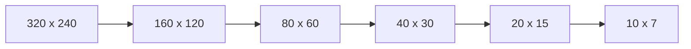

Two pyramid objects alternate as current and previous images. A pyramid object has room for sixteen level records; production requests six. Each level distinguishes its construction data/stride from sampling aliases. Reusing a matching level need not refresh those aliases.

Integer halving discards unmatched trailing rows or columns. At an odd base image size, the fused first pass leaves the final full-resolution row/column untouched because it processes complete pairs. This differs from a generic library resize with an assumed border rule.

### Integral images and wrapped arithmetic

Let $S(x,y)$ be the sum of pixels above and to the left of $(x,y)$, with a zero top row and left column. A rectangle sum is

```math
\mathrm{sum}=S(x_0,y_0)+S(x_1,y_1)-S(x_1,y_0)-S(x_0,y_1).
```

QTM stores these sums in **16-bit unsigned elements**, so running sums wrap modulo 65,536. Feature sign decisions can then depend on the sign bit of a wrapped 16-bit difference. Replacing this with unlimited-precision arithmetic changes the classifier.

Image strides count bytes; integral strides count 16-bit elements. Owned rows are aligned to sixteen bytes. The detector shares a 160×120 resampling buffer and a 161×121 integral buffer at production size. Their requested storage is 19,200 and 40,656 bytes respectively. Individual model objects hold borrowed views of these backing objects.

### Warping a verification crop

A verification crop is a small normalized picture of the proposed face. QTM constructs a map from each destination pixel to a source-image coordinate, then samples the source. This reverse mapping avoids leaving holes between transformed pixels.

The shared correspondence fitter uses translation for one point, a similarity transform for two, and an affine least-squares fit for more than two. An exactly singular affine fit falls back to the first two points, without searching for a better pair. Coincident first points can still cause division by zero. Optional weights enter centroids linearly but enter the centered normal-equation products squared, because both centered vectors are multiplied by the weight. The normal verification wrapper supplies no weights.

Normal face verification uses one bilinearly sampled pyramid level. Its level estimate comes from the affine matrix's area scale, approximately

```math
\text{level}\approx\log_2\sqrt{|\det M|}.
```

The implementation uses a captured exponent/mantissa lookup, quantizes stepping coordinates to Q16, and samples in tiles up to 64×64. Pixel interpolation uses eight fractional bits and a final rounding bias. Clamped sampling stops just short of the final source pixel, rather than universally copying that edge pixel exactly.

A generic mode can blend adjacent levels. SDM also samples adjacent levels, but its point sampler has different coordinate offsets, bounds and output units. These samplers must not be substituted for one another merely because both use bilinear interpolation.

<a id="lbp"></a>
## 5. LBP: deciding whether a region resembles a face

### A face detector built from many small brightness questions

LBP conventionally means **local binary pattern**: encode which small regions are brighter than others. Such comparisons capture local structure while reducing dependence on overall brightness. For example, the relation between an eye socket and adjacent regions may remain useful when the whole image becomes darker.

QTM's classifier is more specialized than the simplest textbook LBP. A model contains a program of feature evaluations, table lookups, score updates and decisions. A small feature says little by itself; many learned decisions combine to accept or reject a candidate window. Several decision lanes and spatial branches share calculations.

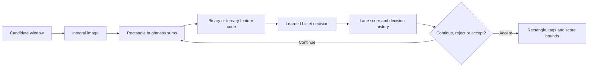

A descriptor packs X/Y offsets, cell width/height and feature family into one 32-bit word: 8, 8, 6, 6 and 4 bits respectively. Only families 0 and 5 appear in the eight shipped classifiers.

### Family 0: adjacent blocks around a ring

Divide the support into a 3×3 grid. Order its perimeter cells clockwise as NW, N, NE, E, SE, S, SW, W. The center is unused. Bit $i$ is the sign bit of the wrapped 16-bit difference between cell $i$ and the next cell around the ring.

```text
NW -> N -> NE
^           |
W     .     E
|           v
SW <- S <- SE
```

This is eight adjacent-perimeter comparisons. It is not eight neighbors compared with one center cell.

### Family 5: five comparisons with three outcomes

Use a 3×2 arrangement:

```text
A B C
D E F
```

With cell area $A_c=\text{cellWidth}\times\text{cellHeight}$, let $T=8A_c$ and let $\mathrm{sign16}(v)$ return the high bit of the low 16 bits of $v$. Define

```math
\tau(d)=\mathrm{sign16}(d+T)+\mathrm{sign16}(d-T).
```

The code is

```math
\tau(B-E)+3\tau(E-F)+9\tau(D-E)+27\tau(B-C)+81\tau(A-B).
```

Each term is a base-three digit, producing codes 0–242. A flat image with nonzero cell area produces 121. The learned lookup tables still have 256 positions.

The feature function includes other families, but they are not needed to execute these shipped model programs. Their existence should not be confused with production model use.

<a id="vm-format"></a>
### Model format and the interpreter's inputs

The classifier is a **virtual machine (VM)** in the modest sense of an interpreter for a small, specialized instruction set. Instead of ARM instructions, its program contains commands such as “measure this brightness pattern,” “update these scores,” and “try this shifted window.” The trained model supplies the instructions, lookup tables and weights. The interpreter supplies their execution rules.

VM navigation: [model format](#vm-format) · [lanes and state](#vm-state) · [instruction layouts](#vm-instructions) · [decisions and gates](#vm-decisions) · [branches and geometry](#vm-branches) · [outputs and stopping](#vm-outputs) · [worked examples](#vm-examples).

One call classifies a window at a supplied integral-image origin. The surrounding scanner chooses that origin and image scale; the VM itself can additionally explore small spatial alternatives. Its inputs are the model resource, integral origin/stride, caller acceptance threshold, output capacity, a traversal token and a stop-at-capacity flag. Its outputs include candidate records, accepted count, success and an updated traversal token. Success means at least one accepted record was emitted.

Multibyte model fields are little-endian: the least significant byte comes first. In the following format tables, offsets are hexadecimal and sizes are decimal. The 56-byte payload header is:

| Offset | Type | Meaning |
| --- | --- | --- |
| `00` | Four bytes | `LBP\x01` |
| `04` | Unsigned 32-bit | Version 13 |
| `08`, `0C` | Unsigned 32-bit | Canonical window width and height |
| `10`, `14` | Unsigned 32-bit | Scan steps X and Y |
| `18` | Float | Log-scale step, approximately 0.2 |
| `1C` | Byte | Scale subdivisions, 1 in the shipped resources |
| `1D` | Three bytes | Zero in these resources; no independent meaning established |
| `20`, `28` | Two floats each | Canonical left/right eye fractions |
| `30` | Unsigned 32-bit | 256 in every shipped model; runtime purpose unresolved |
| `34` | Unsigned 32-bit | Bytecode offset from payload base, 56 |

The ordinary full models use 24×24 windows and unit scan steps; TOP models use 24×12. Acquisition GEOM models use 27×27 or 27×15 and 4×4 scan steps. Eye fractions are metadata for converting a face rectangle into approximate eye positions. The VM emits rectangles and tags, not independently localized eyes.

The packed feature word described earlier occupies bits 0–7 for X, 8–15 for Y, 16–21 for cell width, 22–27 for cell height and 28–31 for family. Feature X/Y are relative to the **current integral origin**, which a spatial branch can change. Integral stride counts 16-bit elements, not bytes. Header word `+30=256` should not be named “cache size” solely because an independently allocated VM cache also has 256 entries.

<a id="vm-state"></a>
### Lanes: several classifier paths sharing image work

A **lane** is a small scorekeeping record for one active classifier path. It is not a processor thread, an eye, or a fixed facial landmark. Four lanes allow the model to maintain different decision histories and scores while sharing the expensive part: reading image features. Their precise trained categories are not established just by their lane numbers.

Each 16-byte lane stores:

| Lane offset | Field | Meaning |
| --- | --- | --- |
| `00` | History byte | The latest eight binary lookup decisions |
| `01`–`03` | Padding | No classifier meaning assigned |
| `04` | Signed 32-bit score | Sum of selected learned weights |
| `08` | Signed 32-bit lower bound | Model-supplied bound accumulated at gates/terminals |
| `0C` | Signed 32-bit upper bound | Corresponding accumulated upper bound |

An active mask uses bit 0 for lane 0, bit 1 for lane 1, and so on. Mask `0011` therefore means lanes 0 and 1 are active. A removed lane stops participating in lane-gated operations on that path. Opcode `12` can copy all sixteen bytes from one lane to another and activate the destination. It is the explicit mechanism for initializing an alternative from existing classifier state.

At call entry, only lane 0's history, score and bounds are initialized, all to zero; only lane 0 is active. Other lanes and cache entries must not be assumed to contain zeros. The rectangle starts at `(0,0,windowWidth,windowHeight)`, stored in bytes. The built path code starts at 1.

The complete saved execution state occupies 92 bytes:

| State offset | Contents |
| --- | --- |
| `00` | Cache write index, advanced modulo 256 |
| `04` | Four 16-byte lane records |
| `44` | Active lane mask |
| `48` | Current bytecode pointer |
| `4C` | Current integral-image origin pointer |
| `50` | Rectangle X, Y, width and height, one byte each |
| `54` | Remaining input traversal-token bits |
| `58` | Path code built during this traversal |

The bytecode pointer is the VM's program counter: it identifies the next instruction. A branch can save this state and restore it later. There is space for sixteen saved states on the interpreter's stack.

Some important data is **outside** those snapshots:

- The 256-byte feature cache is shared. Restoring a branch restores its write index, not the previous contents of the cache.
- Output records and accepted count accumulate across explored paths.
- A partial-rejection flag survives branch restoration.

This distinction explains why “copy all VM state for each branch” would be an inaccurate implementation if it also copied and restored cache contents or erased previously emitted records.

<a id="vm-instructions"></a>
### Instruction encodings

A record begins with an opcode byte. Record length depends on that opcode. Below, `bN` denotes byte offset N, `word@N` a little-endian 32-bit value, and `bits@N` a 32-byte table containing 256 one-bit decisions. Unlisted bytes have no recovered operand role in these operations.

| Opcode | Size | Operands and operation |
| --- | ---: | --- |
| `00` | 8 | Feature descriptor `word@04`; evaluate and append its byte result to the cache |
| `03` | 40 | Lane `b2`, cache index `b3`, signed-byte weights `b4/b5`, table `bits@08`; update from a cached feature |
| `07` | 44 | Lane `b2`, weights `b3/b4`, descriptor `word@08`, table `bits@0C`; evaluate and update one lane |
| `08` | 76 | Lanes `b2/b3`, weight pairs `b4/b5` and `b6/b7`, descriptor `word@08`, tables `bits@0C` and `bits@2C`; share one feature across two lanes |
| `09` | 112 | Lanes `b2/b3/b4`, weight pairs `b5/b6`, `b7/b8`, `b9/bA`, descriptor `word@0C`, tables `bits@10`, `bits@30`, `bits@50`; share one feature across three lanes |
| `0A` | 48 | Lane `b1`, tag `b2`, history table `bits@04`, metadata/threshold floats `@24/@28`, signed-16 lower/upper increments `@2C/@2E` |
| `0B` | 16 | Lane `b1`, signed-16 score threshold `@02`, tag `b4`, metadata/acceptance-threshold floats `@08/@0C` |
| `0D` | 20 | Lane `b1`, ID8 `b2`, tag `b3`, ID32 `word@04`, metadata/threshold floats `@08/@0C`, signed-16 lower/upper increments `@10/@12`; terminal acceptance |
| `0E` | 4 | Lane mask `b1`; partially reject and remove matching active lanes |
| `10` | 8 | Split mask `b1`, absolute payload-relative target `word@04`; separate selected lanes from the rest |
| `11` | 8 | Split mask `b1`, unsigned shift X/Y `b2/b3`, width/height shrink `b4/b5`, destination lane `b6`; spatial split |
| `12` | 4 | Source lane `b1`, destination lane `b2`; copy lane and activate destination |

“Absolute payload-relative” means that target 100 addresses byte 100 from the start of the model payload. It is neither a displacement from the branch instruction nor an offset from the first bytecode instruction.

Opcodes `00`, `03`, `07`, `08` and `09` use byte 1 as a **batch-continuation flag**. Their fixed-opcode inner loop continues while that byte is greater than 1. It advances by the current opcode's record size without redispatching on the next record's opcode byte. This is not a general instruction-repeat count. Shipped programs use homogeneous batches; a parser that dispatches every record independently agrees for those batches, but does not reproduce malformed mixed-opcode batches.

Opcodes `0B` and `0E` are supported by the interpreter but absent from the eight shipped programs. Four-byte `13 00 00 00` separators occur after terminal records. Opcode `13` is **not** an implemented stop instruction. If reached, an unhandled opcode returns to dispatch without advancing the program counter. Valid shipped control flow ends a path through lane deactivation/restoration, before reaching these separators.

<a id="vm-decisions"></a>
### From a brightness code to a decision and a score

A feature code is a byte describing local brightness relationships. Its numerical magnitude is not itself “how face-like” the patch is. An instruction's learned bitset maps that code to a binary decision. For feature value $v$, the lookup is:

```text
wordIndex = v >> 5
bitIndex = v & 31
decision = (table[wordIndex] >> bitIndex) & 1
```

The table contains eight little-endian 32-bit words. For example, code 127 selects word 3, bit 31. Two lanes can use different tables for the same code and obtain different decisions.

For each active lane updated by the instruction:

```text
history = (2 * history + decision) & 255
score = signed32(score + signed8(weight[decision]))
```

The history byte retains the latest eight decisions in order, dropping the oldest when shifted out. The score adds one of two signed weights: decision 0 does not necessarily subtract, and decision 1 does not necessarily add. The model chooses both weights. Score addition wraps to 32 bits.

Opcode `00` writes a feature into the current cache slot and advances the index modulo 256. Opcode `03` addresses an explicit cache slot. Direct feature-update opcodes do not implicitly append their features to the cache. Opcode `07` skips feature evaluation when its named lane is inactive; `08` and `09` evaluate once and update only the active lanes among those named.

A gate then asks whether a lane should continue:

| Instruction | Passing condition | Effect before possible acceptance |
| --- | --- | --- |
| `0A` | Its bitset contains a 1 at the lane's history-byte index | Add signed lower/upper increments to the lane's bounds |
| `0B` | Signed score is at least the signed-16 score threshold | Leave bounds unchanged |
| `0D` | Terminal instruction on an active lane; no additional score gate | Add signed lower/upper increments |

A history gate can distinguish patterns having similar total scores but different recent decision sequences. For example, histories `00000001` and `00000010` select different table bits even if their accumulated scores happen to match.

After a passing `0A` or `0B`, an **early acceptance** occurs only when the caller's float threshold is strictly greater than the model instruction's float threshold **and** output space remains. Equality continues evaluation. Without early acceptance, the lane remains active and execution continues. A failed gate removes the lane and may update the diagnostic rejected record described below.

A terminal `0D` emits an accepted record if space remains, then always removes its lane. It does not need the caller-threshold comparison. Opcode `0E` removes the active lanes matching its mask and sets the shared partial-rejection flag if any lane was removed.

There are thus several different quantities: the feature byte, table decision, recent-decision history, accumulated score, score bounds, model acceptance threshold and caller threshold. None is automatically the public temporal confidence. Downstream code later forms normalized score responses from the score and bounds; the confidence EMA belongs to the frame state machine.

<a id="vm-branches"></a>
### Splitting lanes, exploring alternatives and restoring state

A branch partitions the current active mask into two groups:

```text
selected = activeMask & splitMask
rest = activeMask & ~splitMask
```

It reads the most significant bit of the remaining input token and shifts that token left once. A 1 prefers selected; a 0 prefers rest. If both groups exist, the VM saves one alternative and runs the other. If only one exists, it follows that group regardless of preference. It appends 1 or 0 to the built path code to record the actual direction.

Opcode `10` sends selected lanes to its payload-relative target. Rest lanes continue at the following instruction. Both retain their lane contents and the shifted token.

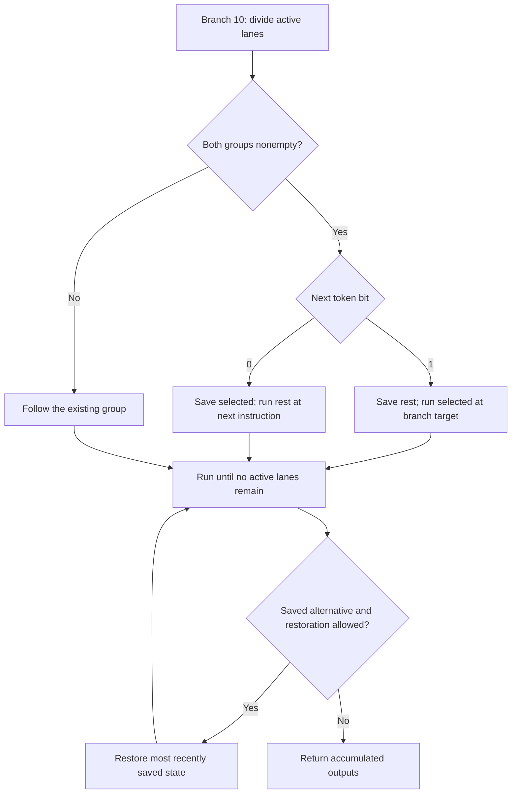

This is depth-first traversal: the most recently saved alternative is restored first. Lanes are not executed concurrently by separate processor threads.

#### Spatial branch `11`

The spatial branch shares this selected/rest mechanism, but changes geometry:

1. Subtract width/height shrink from the current rectangle **before** forming the alternatives. Both alternatives therefore inherit the smaller rectangle. These dimensions wrap as bytes.
2. For the selected alternative, advance the integral origin by `dx + dy * stride` and add dx/dy to rectangle X/Y, also wrapping those rectangle coordinates as bytes.
3. Replace the selected active mask with exactly `1 << destinationLane`. Continue at the next instruction, rather than jumping to a separate target.
4. Leave the rest alternative's origin and X/Y unchanged, with only its selected lanes removed from the active mask.

The destination lane receives **no implicit copy** from a selected source lane. Its score/history/bounds must already have the intended contents. This differs fundamentally from opcode `12`, whose purpose is to copy a lane.

Spatial alternatives also treat the token specially. A saved spatial alternative receives zero remaining token bits. A one-sided spatial branch clears the remaining token when its actual direction disagrees with the requested bit. An ordinary `10` branch does not apply these spatial resets.

The GEOM programs use shifts/shrinks `(2,0)`, `(0,2)`, `(1,0)` and `(0,1)`, with destination lane 0. Along either axis, choosing a shift of 2 and then a shift of 1 yields possible offsets 0, 1, 2 and 3. Both sides shrink at each split, so a 27-wide support becomes 24 wide regardless of which offset is selected:

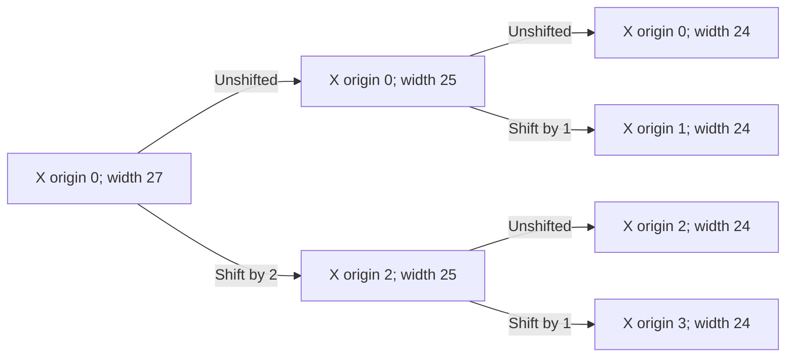

The same construction applies vertically, taking 27 to 24 or TOP height 15 to 12. It explains how a scanner stepping by four can inspect finer subwindow placements inside its larger acquisition window. This is spatial subdivision in the interpreter, not evidence of a separate trained “geometry estimator.”

<a id="vm-outputs"></a>
### Candidate records, rejection diagnostics and stopping

Each emitted record is 48 bytes:

| Offset | Type | Meaning |
| --- | --- | --- |
| `00` | Byte | Accepted flag |
| `01` | Byte | Shared partial-rejection flag for a rejected record; zero for an accepted record |
| `02` | Byte | Tag bit mask |
| `03` | Byte | Untouched padding |
| `04`, `08` | Signed 32-bit | Terminal ID32 and zero-extended ID8; both −1 for early gate output |
| `0C`, `10` | Float | Model metadata and model threshold |
| `14`, `18`, `1C`, `20` | Unsigned 32-bit | Rectangle X, Y, width and height expanded from state bytes |
| `24`, `28`, `2C` | Signed 32-bit | Score, upper bound, lower bound, in that order |

The metadata/ID fields are carried through without establishing their full training meaning. Notice that the output stores upper before lower, whereas the lane stores lower before upper.

At entry, only slot 0's threshold is initialized to 1.0; the full output buffer is not cleared. Before any acceptance, a failing gate can write a **diagnostic rejected record** into slot 0 when its model threshold is strictly smaller than the threshold already there. Later failures can replace it with a still smaller threshold. Its score and bounds are zero. It does not increment accepted count and therefore does not make the call successful.

The first accepted result also occupies slot 0, replacing those diagnostic fields. Once an acceptance exists, failures no longer replace that slot. This is why a failed classifier call can still supply a meaningful threshold to the tracker verification wrapper's threshold shortcut.

Output capacity limits how many acceptances can be stored, but reaching capacity does not immediately interrupt the currently active path. In particular:

- An early gate cannot emit once space is exhausted; a passing lane can therefore continue to later instructions.
- A terminal still removes its lane when full, even though it cannot emit another record.
- When the active mask becomes zero, a saved alternative is restored only if one exists and either space remains or `stopAtCapacity` is zero.
- If restoration is not allowed, the VM returns. With `stopAtCapacity=0`, it can traverse further paths without increasing the already-full output count.

The scanner can therefore request several records from one window, while ordinary crop verification requests capacity one and stops before restoring further alternatives after that result. Classifier traversal order can affect which result a capacity-one caller receives.

### The traversal token is a branch-order preference

The input token is consumed most-significant-bit first at branches. The output token changes only when accepted count equals capacity; otherwise the caller's input token remains unchanged.

On a full result set, QTM adds one to the final built path code, then shifts until its leading 1 has been shifted out. The remaining bits are aligned at the most significant end and become the next token. The leading 1 originally placed in the built path acts as a marker for path length; it is not itself a branch decision.

For example, a built path of binary `10` describes one rest branch. Adding one gives `11`; removing its leading marker and aligning the remaining `1` yields token `0x80000000`. The next call then prefers selected at its first split.

Every call still starts at the program beginning with fresh lane-0 state. It does not restore a program counter, cache or saved branch stack from the previous call. The token changes exploration priority; it is not a suspended execution context or a guarantee of globally unique, nonrepeating results.

<a id="vm-examples"></a>
### Worked example: pixels → two lanes → one accepted face hypothesis

The following is a small illustrative program with explicitly chosen tables and weights, not an excerpt from a shipped face model. It demonstrates the same feature and instruction rules without requiring an understanding of how those weights were trained.

Use one-pixel cells and this 3×3 image patch:

```text
20 30 40
90  0 50
80 70 60
```

Family 0 visits perimeter values `20, 30, 40, 50, 60, 70, 80, 90`. The first seven differences from the next cell are −10; the final difference is `90−20=70`. Thus bits 0–6 are 1 and bit 7 is 0, giving feature code **127**. The center pixel contributes nothing to this feature.

Start with a 24×24 model window, caller threshold 0.25 and output capacity one. Choose these program records; offsets include the 56-byte model header:

| Payload offset | Instruction | Chosen operands |
| --- | --- | --- |
| `38` | `12`: clone | Copy lane 0 to lane 1 |
| `3C` | `08`: shared feature | Family 0, one-pixel cells at origin; lane 0 table bit 127 = 1, weights `(−3,+9)`; lane 1 table bit 127 = 0, weights `(−4,+6)` |
| `88` | `0A`: lane-0 gate | Accept history byte 1; model threshold 0.5; bound increments −10/+20 |
| `B8` | `0A`: lane-1 gate | Accept history byte 1; model threshold 0.375 |
| `E8` | `0D`: lane-0 terminal | Tag mask `0x05`; ID32 42, ID8 7; metadata 0.125, threshold 0.5; zero bound increments |

For simplicity, the two feature tables can have all bits set for lane 0 and all bits clear for lane 1. Each history-gate table has only bit 1 set. Each feature record ends its batch.

The execution proceeds as follows. Lane tuples below are `(history, score, lower, upper)`:

| Step | Active mask | Lane 0 | Lane 1 | Output effect |
| --- | --- | --- | --- | --- |
| Entry | `0001` | `(0,0,0,0)` | Uninitialized | Slot-0 threshold initialized to 1.0 |
| Clone | `0011` | `(0,0,0,0)` | `(0,0,0,0)` | None |
| Shared feature | `0011` | `(1,9,0,0)` | `(0,−4,0,0)` | None |
| Lane-0 gate | `0011` | `(1,9,−10,20)` | `(0,−4,0,0)` | Gate passes; no early acceptance because 0.25 is not greater than 0.5 |
| Lane-1 gate | `0001` | `(1,9,−10,20)` | Inactive | History 0 fails; write a rejected diagnostic at slot 0 with threshold 0.375 |
| Lane-0 terminal | `0000` | Inactive | Inactive | Replace slot 0 with accepted result; count becomes 1 |

The accepted record contains rectangle `(0,0,24,24)`, score 9, upper bound 20, lower bound −10, tag mask `0x05` and the chosen terminal IDs/metadata. The rejected diagnostic did not consume the available slot. With no saved alternatives, the VM returns success.

Downstream crop aggregation can form the normalized response

```math
q=\frac{9-(-10)}{20-(-10)}=\frac{19}{30}.
```

Tag mask `0x05` sets bits 0 and 2, so those two tag accumulators receive this response. It is still not the public temporal confidence, and the LBP rectangle still needs canonical-eye conversion and SDM refinement before becoming the tracker's final eye estimate.

Changing the caller threshold to 0.75 illustrates early acceptance: the passing lane-0 gate can fill slot 0 and deactivate lane 0 before its terminal. That record has gate metadata and IDs −1/−1. Lane 1 can still run and fail, but cannot overwrite the accepted result. Raising the threshold therefore changes where the path accepts, not merely a final yes/no comparison against score 9.

### Worked example: why two calls can choose different lanes

Now consider a separate tiny program: clone lane 0 into lane 1; execute `10` with split mask `0001`; place a lane-1 terminal immediately after the branch, and put a lane-0 terminal at its target. Each terminal has a distinct tag. Use capacity one and `stopAtCapacity=1`.

| Call | Input token | First path | Accepted result | Returned token |
| --- | --- | --- | --- | --- |
| 1 | `0x00000000` | Rest: lane 1, built path binary `10` | Lane-1 terminal | `0x80000000` |
| 2 | `0x80000000` | Selected: lane 0, built path binary `11` | Lane-0 terminal | `0x00000000` |

Each call saves the alternative, but does not restore it after its first terminal fills capacity. The second call recomputes the program from entry; the returned token merely makes its first branch choose the other path. With capacity two, both alternatives can be explored within one call.


### Model selection and tags

| Runtime index | Classifier | Use |
| ---: | --- | --- |
| 0 | `face_SIRL_SVD_SNFF_GEOM.lbp` | Full acquisition, IR off |
| 1 | `face_SIRL_SVD.lbp` | Full verification, IR off |
| 2 | `face_SVD_SNFF_GEOM.lbp` | Full acquisition, IR on |
| 3 | `face_SVD.lbp` | Full verification, IR on |
| 4 | `face_SIRL_SVD_SNFF_TOP_GEOM.lbp` | TOP acquisition, IR off |
| 5 | `face_SIRL_SVD_SNFF_TOP.lbp` | TOP verification, IR off |
| 6 | `face_SVD_SNFF_TOP_GEOM.lbp` | TOP acquisition, IR on |
| 7 | `face_SVD_SNFF_TOP.lbp` | TOP verification, IR on |

Here IR-on model selection means signed frame status greater than zero, including transition value 50. The presence of `SIRL` in a filename does not make that resource the IR-on choice.

A tag is a bit attached to a classifier response. The tracker stores eight smoothed tag responses; these are **not eight independent model scores**. For an accepted result,

```math
q=\frac{\text{score}-\text{lower}}{\text{upper}-\text{lower}}.
```

Crop classification adds $q$ to each set tag and divides by the total accepted count. It also computes $1-\prod(1-q)$ and a mean positional offset, but the tracker verification wrapper discards those latter outputs. The public temporal confidence is computed elsewhere.

On verified frames the stored tags move toward the new tags with coefficient 0.02. Failed verification leaves them unchanged. The current frame's optical-flow refinement chooses its SDM model before this later tag update, so it uses the previously stored responses.

<a id="search"></a>
## 6. Searching the image and choosing a face

Acquisition asks a different question from verification. Acquisition must find a plausible face somewhere in a large image, at an unknown size. Verification already has predicted eyes and asks whether the nearby, normalized face still looks plausible.

### Regions, sizes and scan order

The normal acquisition templates cover 27 × 27 pixels, or 27 × 15 for the upper-face (`TOP`) detector. Default face-width limits are 0.1875 and 0.75 times the image width, with the upper limit also bounded by image height. At 320 × 240 this gives nominal bounds of 60–240 pixels. These bounds select scale indices; they are not a final strict check on every returned rectangle.

With both stored ROI dimensions zero, successive acquisitions cycle through the upper half, lower half and a special strip containing the bottom twelve window-origin rows. That last phase uses the TOP detector. With a nonempty stored ROI, the normal wrapper selects the **middle column of a three-column grid**. It does not select the middle horizontal third. The wrapper passes a zero local preferred rectangle, so the stored ROI width does not independently select a preferred search scale.

The generic region descriptor packs four bytes: a mode and three parameters. Mode 0 describes a grid cell; modes 1 and 2 select top and bottom strips; mode 3 selects a square around a normalized point. The reacquisition path uses the latter. Its radius is derived from a width-scaled parameter, approximately $\lfloor p_3W/511\rfloor$.

Scale indices approximate three steps per octave. An octave is a factor of two in size. The index calculation uses a ratio near $\sqrt[3]{2}$, but the actual images within each octave are:

| Index remainder modulo 3 | Image used | Corresponding coordinate scale |
| --- | --- | --- |
| 0 | Stored pyramid level | 1 |
| 1 | That level resized to 4/5 | 5/4 |
| 2 | That level resized to 3/5 | 5/3 |

Thus the actual scales are deliberately convenient resampling ratios, not exact powers of $\sqrt[3]{2}$. With no preferred size, scanning starts at the maximum selected index. The generic scheduler visits pairs in the order `start, start+1`, then `start-1, start+2`, and so on. If neither member of a pair is valid, it stops; it does not continue indefinitely looking for another valid index.

Window scanning also has an important boundary convention: the origin must satisfy strict inequalities such as $x<\text{cropWidth}-\text{windowWidth}$. The last otherwise-fitting origin is omitted, and an image exactly the size of one window makes no classifier calls. Crop rounding can move the actual sampled origin slightly while the reported rectangle retains the requested region origin.

Three generic search modes control model fallback: primary only; primary followed by TOP if no result exists; and TOP only when no result exists. These are distinct from the region descriptor's modes.

### From classifier hits to a selected rectangle

A classifier hit becomes a rectangle, a weight and eight tag values. The weight is

```math
w=\frac{s-s_{\mathrm{low}}}{s_{\mathrm{high}}-s_{\mathrm{low}}}+0.05.
```

The scanner can collect up to 64 classifier records per window, 128 accepted hypotheses and 256 partial ROI records. Filling a result list does not necessarily stop scanning.

QTM merges nearby hypotheses as they arrive. For rectangles with top-left corners $(p_x,p_y)$ and $(q_x,q_y)$, widths $s_w,t_w$ and heights $s_h,t_h$, it compares

```math
d=\frac{
(q_x-p_x)^2+(q_x+t_w-p_x-s_w)^2+
(q_y-p_y)^2+(q_y+t_h-p_y-s_h)^2
}{s_w^2+s_h^2+t_w^2+t_h^2}.
```

A sufficiently close existing cluster—strictly below the stored float near 0.09—receives the incoming rectangle and tags by weighted averaging; its weight increases by the incoming weight. The nearest cluster wins, with the first retaining an exact tie. This is an online, order-dependent procedure. It is not intersection-over-union suppression, and merging one hit does not trigger a global re-merge of all clusters.

Search can terminate once a cluster reaches weight 1. Final filtering removes clusters below 1 using replacement by the last element, so output order can change. Selection then favors the image center. With rectangle center $(c_x,c_y)$,

```math
n_x=\frac{2c_x-W}{W},\qquad n_y=\frac{2c_y-H}{H},\qquad
w_{\mathrm{center}}=\frac{w}{1+\sqrt{n_x^2+n_y^2}}.
```

The implementation first compares the raw weight against the current adjusted best, then computes and stores the adjusted weight. Strict comparisons retain the first equal candidate.

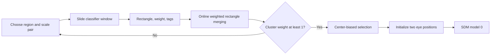

For a full-face rectangle, initial eye positions lie at horizontal fractions 0.27 and 0.73 and vertical fraction 0.25. For a TOP rectangle the vertical fraction is 0.5. These positions are geometric seeds, not independently detected eye pixels. SDM performs the subsequent refinement.

### Early reacquisition near a reference face

For roughly the first two seconds after acquisition, QTM can search again near a reference face. The reference begins updating only after frame 20 and only with the ordinary full verification model. Its smoothing coefficient is approximately 0.0246900916. The default search window ends before frame 60, although reference maintenance continues.

The face rectangle used here derives its width from twice the **horizontal** eye separation, not the length of the eye-to-eye vector. Relative to the componentwise minimum and maximum of the eyes, it extends by $(-0.25,-0.25)$ and $(0.25,0.75)$ times that width. A zero horizontal span receives a one-pixel repair.

Candidate distance is five times the distance between reference and candidate midpoints divided by reference width. A candidate must improve on the current face's distance. Exclusion rectangles reject candidates when the intersection covers at least 30% of the candidate's own area. Search uses the primary model and alternates nearby scales.

One implementation peculiarity matters: the selected rectangle and tags correspond to the best candidate, but the returned eye pair can correspond to the **last overlap-eligible candidate**. The tracker consumes that eye pair and requests no replacement tag output.

A successful early reacquisition copies those eyes into measured and previous-eye fields, clears the ROI and proposes Track. It does not rerun SDM, candidate fusion or the row-dependent correction. It also does not undo confidence or verification changes already made during the frame. Its effect on history depends on whether that frame already published a history record.

<a id="sdm"></a>
## 7. SDM: refining the two eye positions

**Supervised Descent Method** names a family of trained landmark-refinement algorithms. “Supervised” means that training used examples with desired landmark locations. “Descent” means that a learned correction should move an estimate toward a better one. QTM contains the resulting parameters; it does not train its SDM models while running.

The practical idea is approachable: start with approximate eyes, examine brightness at a collection of positions around them, turn brightness differences into numbers, then combine those numbers with stored weights to move the eyes. General SDM systems may repeat this through several stages. Each of the nine models shipped here has **one stage**, two landmarks, two anchors and 256 features. Depending on the model, it uses 194–212 image samples.

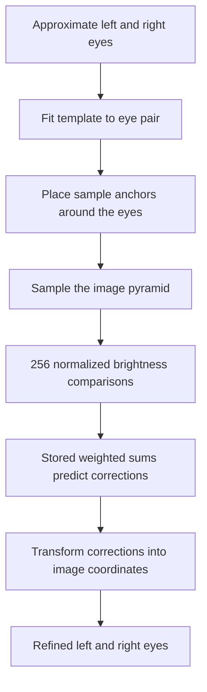

### Placing samples in the face's coordinate system

The model template is approximately $(-1,0)$ and $(1,0)$, with small nonzero stored vertical components. QTM fits a similarity transform from that template to the input eye pair. A similarity transform permits translation, rotation and uniform scaling: an inclined or larger face gets the same sampling pattern, inclined or enlarged accordingly. The initial output is the transformed template, not simply a byte-for-byte copy of the input eyes.

An anchor is a weighted combination of landmarks. In these models, each anchor is one eye with weight 1. Each sample is encoded in four bytes: an unsigned anchor index, two signed coordinate bytes, and an unsigned size byte. The stage maps these small coordinates through the fitted transform.

The coordinate scale is about $1/63.5$ and the sample scale about 0.00313725485. A cached coordinate-origin term becomes 63 through truncation and signed-byte conversion. In simplified notation, with fitted matrix $M$, coordinate scale $c$ and sample coordinate $(x,y)$,

```math
M_s=Mc,\qquad
p=M_s\begin{bmatrix}x\\
y+63\end{bmatrix}+\text{anchor}+\text{cached offset}.
```

The footprint scale also depends on $\sqrt{\det M_s}$ and the size byte divided by 255. Here the determinant expresses how the transform scales area; its square root supplies a linear size. The implementation caches some origin terms, while current sample matrices still use the current coordinate scale.

### Sampling and contrast features

The sampler selects a fractional pyramid level using an approximate logarithm computed from a floating-point exponent and a 256-entry table. It clamps that level to the available range and blends samples from two neighboring levels. Within each image it uses bilinear interpolation: the four nearest pixel values contribute according to distance. A half-pixel offset aligns the sampling grids.

The interpolated intensities are fixed-point values with 16 fractional bits. A feature compares two such intensities:

```math
z=15\frac{I_0-I_1}{I_0+I_1+1},
```

followed by

```math
g(z)=
\begin{cases}
-1 & z<-1,\\
\tfrac12z(3-z^2) & -1\le z\le1,\\
1 & z>1.
\end{cases}
```

The feature stored for regression is $\mathrm{round}_{\mathrm{away}}(8192g(z))$, an integer with 13 fractional bits. Normalizing by the sum makes a feature less sensitive to a uniform change in brightness. The cubic gives a smooth transition and limits the influence of extreme contrast. The added 1 is in the sampler's fixed-point units; replacing the inputs with ordinary 8-bit intensities changes its meaning.

Integer behavior is part of this calculation. The difference numerator wraps as signed 32-bit arithmetic, the denominator uses unsigned arithmetic, and interpolation includes low-32-bit products. A mathematically cleaner implementation can therefore differ at extreme values.

### From features to eye corrections

For each eye and coordinate, the stage computes a weighted sum over 256 features. It shifts **each individual product** before adding:

```math
s=\mathrm{wrap}_{32}\left(\sum_j
\mathrm{ASR}_{13}(\mathrm{low}_{32}(a_jf_j))\right),
```

then forms a correction

```math
\delta=\mathrm{float}(s)2^{-13}\,\text{gain}+\text{float bias}.
```

The fitted face transform maps this local correction into image coordinates. The coefficient table uses signed 32-bit values; four output coordinates times 256 features account for 4096 bytes.

If image sampling fails, the stage is skipped. In the shipped one-stage models, that leaves the transformed initial template. It does not necessarily turn the whole wrapper call into an acquisition failure.

The model header is 44 bytes, marked `SDM1`, version 8. It holds relative offsets to templates and stages, sample/coordinate scales and related terms. Each stage is also 44 bytes and points to anchors, samples, features, floating bias, regression weights, integer bias and gains. The integer-bias table is present but unused by this evaluator. More unusually, the shipped floating-bias offsets are zero, so the evaluator reads header bytes as tiny floating-point values instead of treating zero as “no bias.” Worker floating-point settings can flush these tiny values to zero. A faithful description must preserve that distinction.

### Selecting one of the nine models

Acquisition uses model 0. Tracking starts from model index 2, then applies the following replacements in order:

| Condition on stored smoothed tags | Replacement index |
| --- | --- |
| Tag 2 greater than 0.5 | 4 |
| Tag 1 greater than 0.5 | 6 |
| Tag 3 greater than 0.5 | 8 |

Thus tag 3 takes priority over tag 1, which takes priority over tag 2. Finally, tag 0 above the stored threshold near 0.4, or an override field equal to 1, subtracts one. This produces four odd/even model pairs associated with the resource names `SNG`/`SG`, `SLFR`, `SLFL` and `SLFL_SLFR`. The exact training meaning of those labels is not established by their names.

Selection uses the tags stored before the current frame's later classifier update. IR status does not directly select SDM. The override is initialized/reset to zero; a normal production writer setting it to 1 has not been identified.

<a id="flow"></a>
## 8. Optical flow: carrying a face between images

Optical flow estimates how image content moved between two pictures. It relies on a local approximation: a small patch tends to retain similar brightness while moving a short distance. QTM also fits a shared additive brightness change, which helps when illumination changes between frames.

This stage does not search for fourteen new facial landmarks. It constructs **fourteen patch centers** from the old eye pair and finds a single coherent transform for them. Two centers are the eyes, at template coordinates $(-1,0)$ and $(1,0)$. Twelve more are placed around the face using fixed offsets, including the forehead, cheeks and lower face. The auxiliary offsets are centered around a vertical position near $2/3$.

For eye midpoint $(m_x,m_y)$ and half-baseline $(d_x,d_y)$, the template-to-image transform is

```math
\begin{bmatrix}
d_x&-d_y&m_x\\
d_y& d_x&m_y
\end{bmatrix}.
```

This arranges the patches consistently with the face's size and inclination. The patches themselves remain axis-aligned image patches during sampling.

### Selecting patch size and pyramid level

Initial patch width is $\lfloor0.4\times\text{eye distance}\rfloor$. Widths below 4 fail before the later image-height cap. The normal minimum width is 5, maximum 9, and the scheduler repeatedly halves the width until it fits. Although the generic scheduler supports multiple levels, the ordinary settings usually yield **one selected pyramid level**: after a width in the 5–9 range is halved again, it falls below the minimum. A starting width of 24, for example, yields width 6 at level 2.

This is an important distinction from an algorithm that always runs a long coarse-to-fine cascade. Here the pyramid primarily chooses an appropriate patch scale for the face.

### Solving for a shared transform

The solver has seven unknowns: six coefficients of a 2D affine transform and one brightness offset. An affine transform can translate, rotate, scale and shear the patch arrangement. Local image gradients describe how much brightness changes with a small horizontal or vertical displacement. QTM combines these gradients and brightness residuals into a small linear system, then solves it with Cholesky decomposition. In plain terms, it finds the transform adjustment that best explains the observed patch differences under the current approximation.

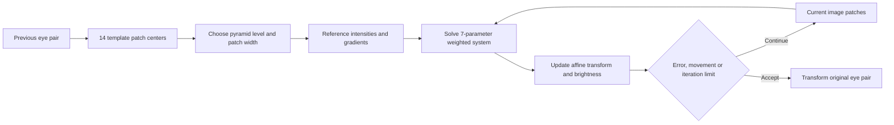

At least five patches must remain active. Invalid patches are removed by moving the last entry into their slot, changing order. The coordinate origin for the linear system is based on the bounding box of all original reference points, before invalid points are removed.

Sampling uses seven fractional bits for interpolation coordinates and five for the stored signed-short intensities/gradients. The initial pixel origin truncates $p-(w-1)/2$ toward zero, rather than applying mathematical floor. Bounds account for an additional pixel needed by interpolation and derivatives. When rows are subsampled, the actual number of processed samples and the normalization denominator differ for odd widths: width 7 can process 21 samples while normalizing by 24; width 9 can process 36 while normalizing by 40.

The residual is current intensity minus reference intensity plus the rounded brightness offset. The patch error is based on squared intensity differences, not displacement of the patch center. Weights begin at 1. From the second iteration, each changes toward $100/(e+5)$ with coefficient 0.8. This reduces the relative influence of poorly matching patches.

The solver updates the transform before checking its stopping conditions. It accepts when mean error is below 2, mean squared point movement is below 0.01, or four iterations have run. Reaching four iterations is a successful termination, not a failure. The reported errors describe the residuals evaluated before the final update. A Cholesky pivot below $2^{-23}$ rejects the solve.

### Deciding whether to use the result

The outer wrapper accepts a fitted transform if **either** the mean error of its best four patches is below 10 **or** its determinant differs from 1 by no more than the stored float near 0.13. These conditions are joined by OR. The determinant condition favors transforms that preserve area reasonably well, even when brightness matching is less convincing.

Accepted output is obtained by transforming the original eyes, rather than by returning the first two entries of the mutable patch list. The wrapper also maintains a separate flow-error estimate. Its target derives from the first two original patch errors divided by eye distance, clamped to 0–10. Its update coefficient depends on how far the fitted transform moves the point $(1,1)$. This value is separate from the tracker's temporal face confidence.

The frame pipeline can retain both the unrefined flow eyes and SDM-refined eyes as candidates. It saves the unrefined flow result into its previous-eye and ROI fields before later frame-state decisions. A subsequent Coast rejection therefore does not imply that all intermediate flow fields remain unchanged.

<a id="frame"></a>
## 9. The complete image-frame state machine

QTM maintains a visual state in addition to confidence and publication flags. These are related, but they are not interchangeable:

| State | Role |
| --- | --- |
| Initialize | Establish image-processing state and enter acquisition |
| Acquire | Search for a face and initialize eyes |
| Track | Predict, run optical flow, refine with SDM and verify |
| Coast | Continue from motion estimates while visual tracking is less secure |
| IR settle | Temporarily avoid ordinary flow/refinement around an illumination change |

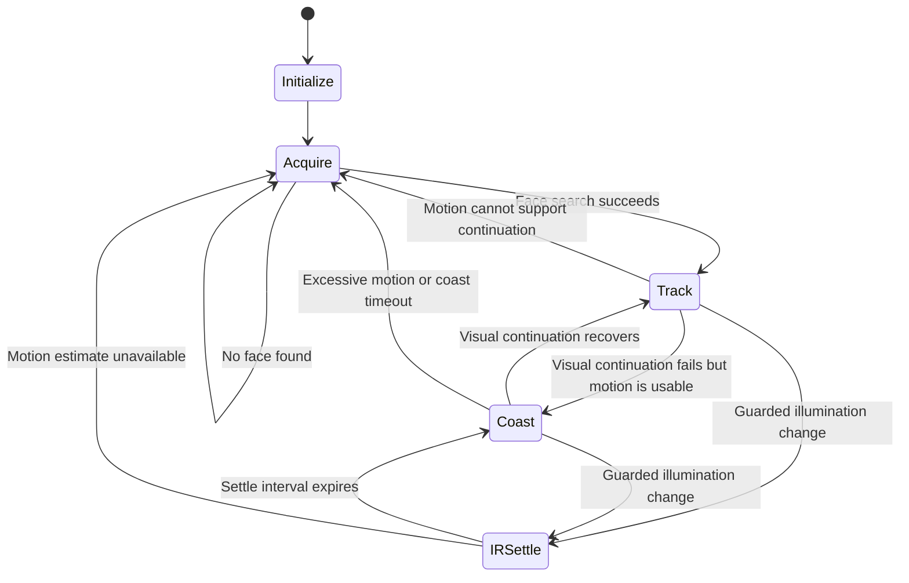

This diagram describes the principal transitions. Within a frame, QTM has both the current state and a proposed next state. Some decisions use the current state even after another branch has proposed a change.

### Frame preparation and missing-frame slots

After obtaining and converting a camera frame, the worker applies pending mode/reset controls. A positive acquisition override persistently forces acquisition, clears the lost state, opens the validity gates and clears the ROI. It is not a countdown. Any nonzero override suppresses missing-frame filling; a negative value has that suppression effect without forcing acquisition.

The mode setter saves its low byte and raises a reset request. The next frame consumes it, enters Initialize and installs the saved mode. Mode 2 is the normal combined image/gyro path. Mode 6 has a peculiar interaction: each frame forces IR-settle state and clears its counter, but the motion-candidate builder does not support mode 6 and returns false. The frame then proposes Acquire without executing ordinary acquisition, flow, SDM or verification on that pass.

A frame gap above $3N/2$, where $N$ is the nominal frame interval, produces an estimated count

```math
\text{elapsedMinusOne}=\frac{\text{gap}-N/2}{N}
```

using integer arithmetic. At most four missing slots are inserted, covering the last four nominal positions. They contain invalid camera observations and zero, invalid raw snapshots. Stable snapshots are not filled in the same way. The flow-motion divisor still uses the uncapped elapsed-frame estimate.

### Acquisition

Acquisition clears the previous tracking fields, initializes candidate weights to $(0,0,1)$ and advances the acquisition epoch. A successful search followed by SDM model 0 provides candidate 2, sets confidence to 0.5, sets the verified flag and proposes Track. A failed search clears the ROI and stays in acquisition.

Setting confidence to 0.5 does not itself clear an already-latched lost state. Recovery hysteresis is handled separately.

### Motion candidates and fusion

Candidate 0 is the motion estimate, chosen from gyro-only, image-only or combined prediction according to mode. Candidate 1 is optical flow; candidate 2 is acquisition or SDM-refined flow. These are the three candidates fused later, not three permanently separate gyro/image/combined slots. Failure of one image prediction path can still leave a candidate validity of 0.75 while the function returns false. Callers therefore use both the boolean result and candidate fields.

In Track or Coast, a sufficiently valid seed starts optical flow. A successful Track flow can receive SDM refinement as candidate 2. When flow fails, very low motion validity—at or below 0.01—forces Acquire; otherwise the next state is Coast. Coast rejects motion with an absolute component of at least five pixels, and more than five coast frames force acquisition. An intermediate “flow succeeded” flag can remain set even if the final next state is Acquire.

The three candidate trust factors are 0.5, 0.9 and 0.1. These are factors in a weighted computation, not percentages that must sum to one. Before fusion, candidate 0's validity is capped by $1-v_1$. With candidate eye position $E_i$, existing weight $w_i$, validity $v_i$ and trust $t_i$,

```math
D=\sum_i w_i v_i t_i,\qquad
E=\sum_{i:v_i>0} E_i\frac{w_i t_i v_i}{D}.
```

The program preserves a particular floating-point operation order and writes the denominator into weight fields used later. The normalized anchor pair comes from this uncorrected fused position while confidence is present.

It then applies a row-dependent motion correction:

```math
E'=E-\left(\frac{E_y}{H}-\frac12\right)\Delta,
```

where $\Delta$ is the midpoint motion relative to the previous-eye field. If flow succeeded, that previous-eye field may already hold the unrefined flow eyes. Fused eyes are saved before applying the correction. The correction's form is consistent with compensating for different capture times across image rows, but its exact physical exposure interpretation is not established.

### Face verification and confidence

Verification warps the predicted face to a canonical image. The full verification window is 24 × 24; TOP verification is 24 × 12. The source triangle uses the saved **uncorrected fused eyes**, not the corrected measured pair. With baseline $B=R-L$ and midpoint $M$, its third point starts at $S=M+(-B_y,B_x)$, then adds $\Delta(S_y/H-1/2)$. This addition has the opposite sign from the measured-eye correction; the first two triangle points stay unchanged. The target third point uses the canonical **width**, including a vertical position of $0.75W$.

The warp uses bilinear interpolation. If the full-face rectangle extends below the image by at least a quarter of its height, QTM selects the TOP base model rather than the full model. No usable overlap leads toward Coast and confidence decay.

The frame's verified flag is true when the classifier accepts, or when a low-threshold shortcut applies. Classification receives an input threshold near $10^{-5}$ and writes back a diagnostic threshold even on rejection. The shortcut compares that output threshold's signed bit pattern against `0x3727C5AC`, approximately $10^{-5}$. Consequently, “verified” does not always imply that the classifier produced a positive response. Shortcut verification can update tags toward zero.

Temporal confidence obeys

```math
c_{\mathrm{new}}=c_{\mathrm{old}}+0.3\left(v-c_{\mathrm{old}}\right),
```

with $v=1$ for verified and 0 otherwise. Below 0.2, QTM latches loss and clears two validity gates. While lost, confidence must exceed 0.8 to clear loss and open the immediate gate. A delayed gate opens after a further three frames. These thresholds provide hysteresis: a marginal face does not alternate immediately between present and absent.

A guarded IR-status change can enter settling only after more than 30 frames since acquisition and while the settle counter is at most 3. Both status 50 and status 100 select the IR-on classifier family. Settling increments its counter and eventually proposes Coast; ordinary flow/SDM is skipped, but relevant verification can still occur.

### Publication order and fallback anchors

History publication is conditional on the lost state at the publication decision. With confidence present, QTM can publish before verification and its confidence update. When already lost, publication occurs after feedback. Early reacquisition is also later than several of these operations.

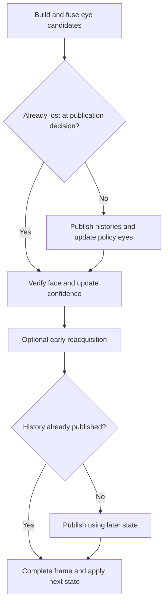

Thus a frame's public metadata, published observation and proposed next visual state need not all describe precisely the same decision point.

Policy eyes usually use measured eyes, but loss, acquisition and settling can select fallback anchors. After more than twenty fallback frames, the anchor midpoint is clamped and multiplied by 0.95 on successive updates, tending toward the image center; the half-separation is restored to 0.1629 in normalized coordinates. Settling suppresses that decay except in mode 6. In applicable gyro modes, anchors can be transported using camera records and their gyro indices without separately requiring their observation-validity bytes.

<a id="gyro"></a>
## 10. From raw gyro samples to camera-motion estimates

The gyro measures rotation of the console, not translation of the viewer's head. QTM first turns raw sensor counts into integrated angles. It then uses a camera projection model to estimate how that rotation moves an eye's apparent image position.

### Reading and calibrating the sensor

The HID shared-memory ring contains 32 signed 16-bit XYZ triples, current/previous timestamps and a current index. The reader obtains a stable metadata snapshot and returns at most 31 samples, newest first. Processing subsequently visits the samples oldest first so that filters and integration evolve in chronological order. The physical meaning and sign of the three sensor axes should not be inferred solely from the XYZ field names.

Factory gyro calibration contains nine signed 16-bit values: zero, positive reference and negative reference for each axis. For an axis,

```math
f=\frac{\text{positive}-\text{negative}}{936},\qquad
r=\frac{\text{sensitivity}}{f},\qquad
q=\mathrm{round}_{\mathrm{away}}\big((\text{raw}-\text{zero})r\,\text{userGain}\big).
```

The ratio calculation uses double precision. The later conversion from corrected counts to turns per second uses a float scale $1/(360\,\text{sensitivity})$. Each corrected integer enters a 256-entry history ring.

### Smoothing and bias estimation

For each new value $q$, the filter searches backward through contiguous historical values close to $q$. The allowed radius is a configured motion radius divided by the counts-to-turns scale, rounded to an integer; a zero result is replaced by 1. The search stops at the first mismatch or the configured window length, normally 100.

For a matching run of length $n$ within window $W$,

```math
f=\frac{n-1}{W-1},\qquad w=f^{32},\qquad
q_s=q+(\mathrm{mean}-q)w.
```

Five successive squarings compute the high power. A short matching run gives a tiny weight, leaving the new sample nearly untouched. A long stable run increasingly permits averaging and bias adaptation. Zero-filled startup history participates in this search; there is no separate valid-entry count for the integer ring. When bias learning is enabled,

```math
b\leftarrow b+(q_s-b)(\alpha_b w).
```

The output subtracts the stored bias even when learning is disabled. Three presets provide radius/bias-rate pairs $(0.02,0.04)$, $(0.01,0.02)$ and $(0.005,0.01)$; the middle one is the normal selection. An optional dead zone, disabled by default, uses a threshold near 0.005 with inclusive boundaries. Its internal quality metric is unrelated to face confidence.

An optional 3 × 4 affine correction can mix the three rate axes and add offsets. Identity detection considers all twelve entries, and transformed outputs use the original input vector rather than partially updated components.

### Integration and the separate orientation matrix

Cumulative turns advance by

```math
\theta\leftarrow\theta+0.01\,\omega,
```

where $\omega$ is turns per second. This is a fixed nominal 10 ms integration step per sample, not integration against an individual timestamp attached to each raw sample. The cumulative value does not wrap at one turn.

A 60-byte output record contains rates, cumulative turns and a 3 × 3 orientation matrix. The orientation matrix follows a separate approximate rotation/repair routine. The head tracker consumes the **cumulative turns**, not that matrix. Matrix repair combines normalization, cross products and averaging; it should not be substituted for the angle path when reproducing tracking.

The reader has an initial construction-relative interval of about 150 ms during which it limits the first output batch. Once that startup decision is consumed, the ordinary 31-sample limit applies. Samples consumed before the first camera frame are not automatically replayed into the tracker later. A separate cached/replay path exists, but its ordinary production producer has not been identified.

### Building the tracker gyro history

The tracker converts cumulative turns to radians using the exact float `0x40C90FDB`, representing $2\pi$, and stores three angles plus the low timestamp word in a 64-entry ring.

With fewer than two existing history entries, ingestion keeps only the newest input sample. In the steady path it processes the supplied batch oldest first. It estimates spacing from the batch timing, smoothing an acceptable measured interval with coefficients 0.99 and 0.01. The acceptance comparison requires the measured interval to be strictly less than twice the old interval. Depending on this decision, timestamp assignment starts from the previous newest timestamp plus the new interval or from the batch timestamp. Later entries are spaced forward; the final assigned timestamp can therefore lie beyond the batch timestamp.

These are stored angle samples with reconstructed timing. They are not future-angle predictions.

The live gyro/barrier worker reads the sampler before checking whether the first camera frame has arrived. Before that frame it yields without tracker ingestion or phase publication, while the sampler can already have advanced. An empty first read causes one 15 ms event wait and one retry. After a camera frame exists, even a second empty read can be followed by barrier prediction and publication; the zero-count gyro-dispatch callback itself is a no-op. This is another reason output cadence cannot be equated directly with camera FPS or nonempty gyro batches.

### Converting rotation into apparent eye motion

The tracker normalizes pixel coordinates as

```math
x=\frac{2p_x-(W-1)}{W-1},\qquad
y=\frac{2p_y-(H-1)}{W-1}.
```

Positive $x$ points right and positive $y$ points down. Both axes divide by image width minus one. The field-of-view terms are

```math
t_x=\tan(F/2),\qquad t_y=0.75t_x.
```

QTM maintains an adaptable two-component axis projection $(u,v)$. For a gyro increment $(g_x,g_y,g_z)$, define

```math
r=ug_y+vg_z,\qquad h=vg_y-ug_z,
```

```math
A=1/t_x+t_xx^2,\qquad B=1/t_y+t_yy^2,\qquad c=2/\pi.
```

The incremental apparent motion is

```math
\Delta x=-cyr+Ah,\qquad
\Delta y=cxr+g_xB.
```

The quadratic terms express perspective: the apparent displacement from a small rotation varies across the image. This is why a single constant pixel offset cannot represent every gyro-induced movement.

Before use, angle increments are clamped to $\pm\pi/2$; NaNs become zero and infinities become the corresponding endpoint. For ordinary finite inputs, each absolute point coordinate must be below 10. The actual unordered comparisons also admit some NaN inputs, as detailed in the numerical chapter. The integrator walks the angle-history increments in order, updating the point after each one. It can also apply an endpoint correction. The final coordinate clamp is $x\in[-2,2]$, $y\in[-1.5,1.5]$, with NaNs mapped to zero.

Because each increment acts on the evolving point, applying the sum of all rotations once is not equivalent. Walking backward with negated increments is also not an exact algebraic inverse.

### Adapting the projected gyro axis

When two suitable camera observations and their gyro indices exist, QTM can adjust the axis-projection angle. It requires sufficient gyro change—some component above 0.015—and midpoint movement—some component above 0.03. It considers three angles around the current angle, spanning $\pm0.03$ and clipped to approximately $[-\pi/2,0]$.

The cost is 1000 times squared normalized midpoint error. A candidate must strictly improve on the current acceptance bound, initially 0.3. An eligible update rewrites the projection even if the selected angle is unchanged. When tracking is lost, the default captured projection is restored. This is a small online geometric adjustment, distinct from both SDM and the image-motion predictors.

<a id="learning"></a>
## 11. Learning short-term image motion

Camera motion from gyro explains only part of apparent face motion. The viewer can move independently. QTM therefore learns very small linear predictors from recent observations.

There are four two-component image filters: one-step and two-step predictors for raw and stabilized histories. A related three-component filter handles gyro quantities. Each predictor uses three past vectors and just **three coefficients shared by all vector components**. This is a compact online regression, not a neural network.

### What a predictor outputs

For observations $p_0,p_1,p_2$, newest first,

```math
\widehat p=c_0p_0+c_1p_1+c_2p_2,\qquad
\Delta p=\widehat p-p_0.
```

The coefficients sum to 1. This makes the prediction respond consistently when every observation is translated by the same amount. The filter returns a displacement, a predicted tick, an error measure and validity. Prediction needs the lowest three usable-history bits to be set. The predicted timestamp uses the newest observed spacing and the filter's one- or two-step horizon; it does not read an externally supplied query timestamp.

Initial priors are $(2.5,-2,0.5)$ for one step and $(3,-2,0)$ for two steps. Both reproduce a constant-velocity continuation at their respective horizons. They are not a general guarantee of exact quadratic-motion extrapolation.

### Learning the coefficients

The sum-to-one constraint leaves two free coefficients. Let

```math
r_0=p_1-p_0,\qquad r_1=p_2-p_0,\qquad y=p_{\mathrm{target}}-p_0.
```

The prediction relative to $p_0$ becomes $\beta_0r_0+\beta_1r_1$. Least squares chooses $\beta$ to minimize squared differences from observed targets. QTM accumulates a 2 × 2 matrix of products and a two-component vector of target products, combining both image axes.

For current contributions $G,g$, old state $M,b$, smoothing parameter $s=0.95$ and adaptation weight $w$,

```math
\rho=1+(s-1)w,
```

```math
M\leftarrow G+\rho(M-G)+\lambda P,\qquad
b\leftarrow g+\rho(b-g)+\lambda q,
```

where $\lambda=10^{-6}$ and

```math
P=\begin{bmatrix}2&1\\
1&2\end{bmatrix}.
```

The prior vector $q$ differs by horizon: $(-3.5,-1)$ or $(-4,-2)$. This small regularizing contribution discourages unstable solutions when recent motion supplies little information. After solving $M\beta=b$,

```math
(c_0,c_1,c_2)=(1-\beta_0-\beta_1,\beta_0,\beta_1),
```

with a particular stored operation order. An exactly zero determinant prevents a coefficient update, but the newly accumulated matrix/vector remain stored.

### Reliability controls learning separately from prediction

The residual is the distance between the previous prediction and the new target. Its smoothed estimate uses a 0.95 history factor, with special handling for an initial value exactly equal to 1 and residuals above 1. The adaptation weight is the residual divided by a scale near 0.04, clamped to 0–1. A strictly positive weight and the required strict-history mask are necessary for learning.

QTM distinguishes usable observations from strictly reliable observations:

| Push mode | Usable for prediction | Strictly reliable for adaptation |
| --- | --- | --- |
| 0 | Yes | Yes |
| 1 | Yes | No |
| 2 | No | No |

The strict masks differ with horizon because the future target aligns with different prior samples. Residual bookkeeping can occur even when adaptation is skipped, and can occur again when the new observation is pushed.

Reset is deliberately partial. It restores coefficients to $(1,0,0)$, clears ordinary observation/usable history and sets residuals to 1. It retains learned normal-equation state, priors and certain strict-history bits. Reset therefore does not mean “construct a fresh predictor from scratch.”

<a id="prediction"></a>
## 12. Histories and the two prediction paths

QTM does not expose one universal “current head position.” It maintains several histories and has separate consumers for the public API and the barrier worker.

### What each ring stores

| Ring | Capacity | Record size | Main contents |
| --- | --- | --- | --- |
| Gyro | 64 | 16 bytes | Three cumulative angles and low timestamp |
| Camera | 5 | 56 bytes | Angles, low timestamp, measured/stable eyes, gyro index, observation validity |
| Raw snapshots | 8 | 96 bytes | Base eyes, three prediction knots, epoch, gyro index and angles |
| Stable snapshots | 8 | 96 bytes | Same layout, with stabilization/loss handling |

A prediction knot contains a two-component displacement, low timestamp, error and validity. There are knots for the base observation, one-step future and two-step future. A snapshot is therefore a small motion curve rooted in one camera frame, not simply an eye pair.

Camera-record validity is based on whether the visual state is Acquire. It is not equivalent to confidence, verification, or finite coordinates. Snapshot insertion writes semantic fields, advances the ring index and saturates the count; padding bytes need not be initialized anew.

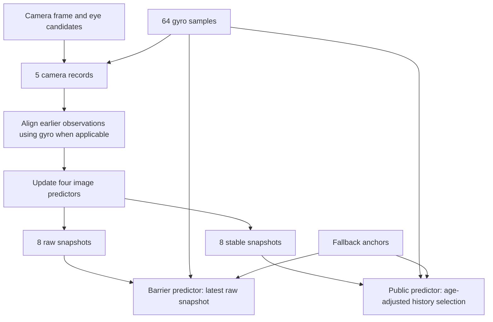

### Updating histories after a frame

The history manager collects prior midpoints and delayed observations, optionally transports them into a common gyro frame, inserts the current camera observation, and constructs learning targets. In combined mode it can align previous observations to the newest one and propagate targets back into the coordinate frame appropriate to each predictor.

Raw predictor adaptation uses a complete set of three strict observations. Stable adaptation additionally waits for a longer reliable run, beyond thirteen prior reliable frames. After insertion, observation arrays can be re-aligned without rewriting all associated metadata. Axis adaptation or lost-state restoration then influences later gyro projection.

The observation mode generally follows this table:

| Frame condition | Predictor push mode |
| --- | --- |
| Track with confidence present | 0 |
| Track while lost, Coast, or IR settle | 1 |
| Initialize or Acquire | 2 |
| Explicitly disallowed observation | 2 regardless of the above |

Each raw snapshot starts from the measured eyes. Knot 0 has zero displacement at the camera tick. Successful predictors supply future displacements, ticks and errors. Failed predictions produce zero displacement, tick zero, error 1 and invalidity.

### Stabilization and loss behavior

QTM's small-motion smoother suppresses jitter using

```math
\alpha=\mathrm{clamp}\left(\frac{\lVert t-o\rVert}{T},0,1\right),\qquad
\text{output}=o+\alpha(t-o).
```

Here $o$ is the old value, $t$ the target and $T$ a threshold. Small changes are attenuated; changes larger than $T$ pass through completely. It is not a maximum-speed limiter. Defaults include thresholds around 0.02 and 0.04 for the relevant eye/prediction smoothing paths.

The first stable snapshot does not use learned future motion: it starts with zero future displacements at nominal future ticks. Later snapshots attenuate predicted displacements toward zero and smooth reliable eyes from previous stable eyes toward measured eyes.

When confidence is lost, the stable path spends ten frames reducing inherited prediction motion and moving toward fallback anchors. Its blending schedule uses smoothstep

```math
S(r)=3r^2-2r^3,\qquad
\alpha=\frac{S(r_{\mathrm{next}})-S(r_{\mathrm{current}})}{1-S(r_{\mathrm{current}})}.
```

It carries forward old knot displacements, not all old knot metadata, and blends them toward zero. Error grows with the correction length, capped where that update specifies. After ten lost frames, knot displacements are explicitly zeroed. Eye positions still pass through their own small-motion smoothing, so they need not equal the fallback anchors exactly at frame ten.

### Public requested-time prediction

The public predictor estimates a requested time relative to the current system tick. An exactly zero 64-bit requested timestamp means “now.” Otherwise the relevant arithmetic uses the low timestamp word. The normalized horizon is

```math
h=\mathrm{clamp}\left(
\frac{\mathrm{signed32}(t_{\mathrm{request}}-t_{\mathrm{now}})}{N},-1,5
\right).
```

History selection is based on **now**, not directly on the requested timestamp. QTM estimates publication age from the latest snapshot, uses a slowly adapting envelope/delay estimate, and looks backward through at most six stable snapshots. It separately selects gyro history around now minus the estimated gyro interval, examining at most 48 entries.

The age estimator accepts signed ages below three nominal frames, including negative values. Its rolling envelope has a 300-update window; the smoothed delay changes by coefficient 0.01 and is then raised to at least the current age. This measures publication/history age, not a newly measured camera exposure delay.

If selection lands between two stable snapshots, both are evaluated at the same requested horizon and gyro endpoint, then their results are interpolated. The oldest-search boundary can produce an unclamped interpolation fraction. Selecting the newest record avoids that two-record interpolation. Epoch changes and validity flags do not independently veto every such blend.

Within a snapshot, let $b$ be base eyes and $k_0,k_1,k_2$ the displacement knots. Up to one frame ahead,

```math
p(h)=b+k_0+(k_1-k_0)h.
```

Between one and two frames,

```math
p(h)=b+k_1+(k_2-k_1)(h-1).
```

At and beyond two frames, define

```math
P=b+k_2,\qquad Q=P+3\big((b+k_1)-P\big),\qquad
s=(h-2)\,c_3,
```

where $c_3$ is the captured float approximately 0.33333. The late curve is

```math
p(h)=(-Q+3P)s^3+(2Q-5P)s^2+(P-Q)s+P.
```

At a horizon near five frames this tends toward normalized zero. It pulls **both eyes** toward zero, including their separation, rather than merely stopping their velocity. Error interpolation also has asymmetric rules: it interpolates toward a larger next error, and the late branch moves error toward 1 without a universal final clamp.

Gyro propagation follows when the snapshot has a usable gyro anchor. Finally the predictor returns tangent-like coordinates $(xt_x,-yt_y)$, introducing an upward-positive vertical sign.

If either stable history or gyro history is absent, the public predictor returns transformed fallback anchors with error 1 without obtaining a current system tick. Even image-only public prediction passes through this history-availability requirement.

### Barrier prediction is a different path

The barrier worker copies current anchors under a short lock, then reads the relevant prediction histories outside that lock. It uses the latest **raw** snapshot rather than the age-adjusted stable-history selection.

| Mode | Barrier eye source |
| --- | --- |
| 0 or 6 | Anchors, optionally propagated through gyro |
| 1 | Image prediction knots |
| 2 | Image prediction plus gyro when its anchor index is valid; otherwise fallback |

The mode 1/2 path can read the current raw slot without a separate count guard. It ignores snapshot base-eye/error/epoch fields in places where the public path uses them; future-knot validity controls the available interpolation. Depending on available knots, interpolation fractions are clamped to ranges 0–1 or 0–2. There is no late cubic collapse.

Its timestamp argument is always a low-word time, with no special zero sentinel. The caller obtains the current time; there is no extra fixed “predict the barrier one frame ahead” offset added here. Gyro propagation ends at the latest available gyro sample, not a fabricated future sample.

### Camera-to-gyro lookup boundaries

The lookup used to attach gyro data to a camera frame searches for a strictly earlier sample, within a 48-entry limit. At an exact newest timestamp it can select the preceding sample and interpolate with fraction 1. A query newer than the newest sample can return the newest angles without replacing the caller's index. At the oldest boundary it can fail after having copied angle data while leaving the index untouched.

The normal caller initializes angles to zero and the index to −1, then does not use the returned status to undo partial outputs. Therefore angle data and a valid history index must be interpreted separately. Likewise, the short anchor-copy lock does not make every subsequent history read an atomic snapshot of one generation.

<a id="calibration"></a>
## 13. Calibration and eye position to barrier phase

The face tracker estimates two eye positions in the camera image. Barrier phase is then computed from their **midpoint** using calibration. This path does not derive a fresh viewing distance from measured eye separation.

### The six-float calibration record

The persisted record is 24 bytes:

| Raw offset | Field | Actual use |
| --- | --- | --- |
| `+0x00` | Barrier center | Offset added to phase |
| `+0x04` | Translation X | Parsed/stored; no effective contribution to the recovered phase formula |
| `+0x08` | Translation Y | Parsed/stored; no effective contribution to the recovered phase formula |
| `+0x0C` | Rotation Z in degrees | Rotates the eye midpoint before phase calculation |
| `+0x10` | Camera field of view in degrees | Tracker projection, barrier gain, and startup public-output gains |
| `+0x14` | Viewing-distance parameter | Scales barrier gain |

Defaults are center 6.5, translations zero, rotation zero, field of view 66.4 degrees and distance 301. The barrier manager also uses an internal interocular-distance parameter of 62 and hysteresis 0.01. The distance parameters are consistent with millimeters, but that physical-unit interpretation is separate from their established numerical role. Interocular distance is not one of the six raw calibration fields.

Startup parsing contains a copy peculiarity: raw translation X is copied into both parsed translation fields. Live calibration parsing copies X and Y separately. Because the recovered phase path does not use those translations, this difference does not add a hidden translation term to the formula.

### Computing the phase

Let $F$ be the stored field of view in degrees, $d$ the degree-to-radian float, $D$ the distance parameter and $I$ the internal interocular parameter. The manager computes

```math
t_x=\tan\left(\frac{Fd}{2}\right),\qquad
K=\frac{D(12t_x)}{I}.
```

It also computes a vertical-related term

```math
t_{y,\mathrm{manager}}=\frac{\tan\left(0.75Fd/2\right)}{0.75},
```

but that term is not consumed by the recovered horizontal phase calculation. It should not be confused with the tracker's $t_y=0.75t_x$.

For pixel-space eye midpoint $m=(m_x,m_y)$ and calibrated rotation $\phi$,

```math
\begin{bmatrix}m'_x\\
m'_y\end{bmatrix}
= \begin{bmatrix}\cos\phi&-\sin\phi\\
\sin\phi&\cos\phi\end{bmatrix}
\begin{bmatrix}m_x\\
m_y\end{bmatrix},
```

```math
p=\text{center}+\left(\frac{m'_x}{W}-\frac12\right)K.
```

Rotation occurs around the raw image origin **before** horizontal centering. Moving the centering operation inside the rotation changes the result for nonzero rotation. There is no subtraction of the stored X/Y translations in this path.

With zero rotation, moving the midpoint right increases the unwrapped phase according to $K/W$. Eye separation does not directly alter the phase. If this formula is rewritten in a centered normalized coordinate with the corresponding width convention, the horizontal factor contains 6 rather than 12 because the normalized range spans two image widths in its definition.

### Hysteresis and cyclic phase

The manager retains a previous rounded, unwrapped phase. For a new float phase $p$, it first rounds ties away from zero. If that candidate is exactly one below the previous integer, it adds 0.01 to $p$; if exactly one above, it subtracts 0.01. It stores the rounded adjusted phase and returns the adjusted float.

The worker rounds again and reduces to a nonnegative value modulo 12. Adjacency for hysteresis is checked **before** modulo reduction. A transition between physical phases 11 and 0 is therefore governed by neighboring unwrapped integers, not a separate circular-distance comparison.

For example, with previous integer 6 and new $p=6.505$, the candidate is 7, so hysteresis adjusts $p$ to 6.495 and retains 6. A larger movement eventually crosses the shifted boundary.

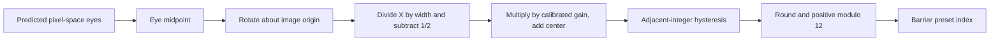

### Live calibration and persistence

The calibration handler first checks QTM availability, returning `0xC8A18009` if unavailable. It then optionally persists the raw record to CFG block `0x180001` and commits it **before** applying live runtime changes. A negative persistence result stops the update. The subsequent runtime wrappers have additional run/camera-available gates: persistence can succeed while those gates prevent an equivalent immediate live change.

The privileged IPC copies the six raw words out of the incoming TLS command buffer before nested CFG requests reuse that buffer. Persistence is selected by the signed low byte of request word 7: any nonzero byte enables it, while a word such as `0x100` has a zero low byte and does not. This differs from directly calling the internal function with a nonzero full integer.

On the normal live path, the parsed temporary distance starts at 301. The barrier setter rebuilds derived values, the caller explicitly rebuilds again, the tracker receives the new field of view, and finally the requested distance is installed with another rebuild. Thus the ordinary sequence rebuilds barrier state three times. Rebuilding reinitializes the previous rounded phase from the center.

Histories and learned predictors are retained. Public-output gains computed at startup are also retained; the live field-of-view setter does not refresh them.

Zero field of view exposes a mismatch between consumers. The barrier calibration setter rejects it with result 70, but its caller ignores that result and can still update distance. The tracker accepts the field of view, producing zero tangent scales and problematic reciprocals. The IPC can still report success and the raw record may already have been persisted. This path performs two manager rebuilds rather than the normal three.

The center-only IPC enforces $0<\text{center}<13$. The full calibration-record IPC does not apply that same center restriction.

### Startup gains used by public coordinates

Public coordinate gains are initialized through a table-based trigonometric path, distinct from the barrier/tracker tangent routine. It evaluates a half-field-of-view angle using a table with 256 units per full turn. With the resulting ratio $T$,

```math
g_x=\frac{T}{0.6358439326},\qquad
g_y=\frac{0.75T}{0.4769752622}.
```

The loaded image contains gains near 1.06388 and 1.063676. These are runtime values in that image, not universal hard-coded calibration constants. Table approximation and operation order also make this path differ slightly from a direct mathematical tangent.

The practical consequence is that field of view has three connected but distinct roles: internal tracking projection, barrier-phase gain, and startup public-coordinate gain. A live update reaches the first two immediately but leaves the third unchanged.

<a id="barrier"></a>
## 14. Driving the parallax barrier

The barrier output manager turns a preset index into two alternating 16-bit words sent to a TCA6416A I/O expander. The expander does not autonomously advance the barrier pattern; QTM repeatedly writes output registers.

### Presets and initialization

The low-word table is:

| Index | Low word | Meaning |
| --- | --- | --- |
| 0–3 | `03F0`, `07E0`, `0FC0`, `0F81` | Dynamic phases |
| 4–7 | `0F03`, `0E07`, `0C0F`, `081F` | Dynamic phases |
| 8–11 | `003F`, `007E`, `00FC`, `01F8` | Dynamic phases |
| 12 | `0000` | Transparent/2D preset |
| 13 | `0E0F` | Static-3D preset |

For each preset, the alternating high word is the low word XOR `0x1FFF`. These are thirteen driven bits; the bit patterns alone do not establish a complete physical wiring or optical-slit model.

Initialization configures GPIO mask `0x20000` as an output and drives it high. On I²C device 16, QTM writes two zero bytes beginning at configuration register 6, making the expander pins outputs, and writes zeros beginning at output register 2. Subsequent alternation writes the output registers 2 and 3. It does not use the expander's polarity-inversion registers to produce the alternation.

### Choosing transparent, static or dynamic output

The manager selects output mode as follows:

1. If LCD mode is not 2, use transparent output.
2. Otherwise, if activation state is nonzero, or if the camera is in use while automatic barrier control is enabled, use static 3D.
3. Otherwise, use dynamic output.

The worker evaluates this after an initial three-iteration interval and then at two-iteration intervals. These iteration counts are not a fixed frequency specification.

Transparent mode enables an override and retains the stored phase field. Static mode clears the override and writes phase 13 into that field. Dynamic mode uses the stored phase. Consequently, returning from static to dynamic can initially retain 13 until another phase publication arrives; there is no independent hidden “last dynamic phase” restored automatically.

Publishing a phase also clears an unavailable/blacklist byte and signals the output event, even if the phase did not change. When automatic phase selection is disabled, publication uses the stored low-byte phase instead of the newly calculated dynamic phase.

### Alternation, wakeups and shutdown

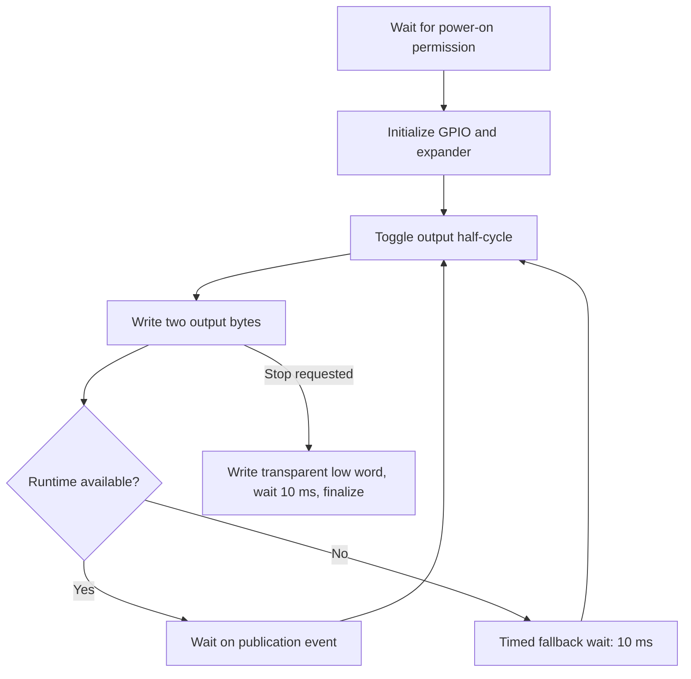

The worker polls power permission at 1 ms intervals, toggles its half-cycle before writing, and normally waits indefinitely on a light event afterward. When the runtime is unavailable it uses a 10 ms fallback wait. Therefore the code does not establish one universal independent refresh rate such as “always 60 Hz.” Effective wakeup timing depends on publishers and operating state.

The normal active exit writes the transparent low word, waits 10 ms, then finalizes. Exiting before initialization or while retrying can bypass this active-output epilogue. Finalization itself is distinct from the main notification path's 100 ms wait.

The hardware-control service can directly supply a 16-bit word; its alternating partner is that word XOR `0x1FFF`, complementing the same thirteen bits. This bypasses ordinary calibrated dynamic-phase selection while hardware control is active.

The retry path retains connection state and counts failures across successes. It performs 31 waits of 100 ms before the 32nd failure reaches its terminal error path. This matters for interpreting the code's state, but ordinary operation assumes successful device access.

<a id="ir"></a>
## 15. Automatic and manual infrared illumination

IR control consists of three separate layers:

- A camera-frame policy decides whether illumination would help.
- A queued request is applied by the capture backend at vsync.
- IPC handlers can issue immediate camera commands and change ownership flags.

A policy decision, a queued request, the last commanded status and the status attached to a processed frame are separate values. Treating them as one boolean loses important behavior.

### When automatic policy runs

Automatic management requires dynamic operation, no hardware-control owner and no user-IR ownership flag. Activity additionally requires either an active ordinary user/system service session or LCD mode 2 with activation state 0. A special-service session alone does not satisfy the session-based activity condition.

If activity disappears after an active period, the manager immediately requests off, resets policy and clears its previous-active latch. It does not clear every queued request or frame-status field. If an outer ownership/dynamic gate prevents entering automatic management, policy state and the previous-active latch are retained instead.

### Motion measures and default thresholds

The policy observes tracker verification, frame-associated IR status, light level and motion. With nominal frame rate $F=30$, it measures squared gyro-angle differences multiplied by $F^2$, smoothed with coefficient 0.2. The first gyro comparison is zero.

Head motion uses midpoint displacement when two consecutive frames are verified. Otherwise its target is 400, corresponding to the squared 20-pixel-per-second threshold. It smooths this value with coefficient 0.1. These motion measures are not the tracker's confidence value.

| Setting | Ordinary value |
| --- | --- |
| Initial off-state probe interval | 1 update |
| Maximum probe interval | 90 updates |
| Unverified TrialOn limit | 5 updates |
| Unverified TrackingOn limit | 600 updates after runtime configuration |
| Initial TrialOff interval | 150 verified updates |
| Maximum TrialOff interval | 1800 updates |
| Status-mismatch limit | 4 updates |
| Dark-environment criterion | Lux strictly below 50 |
| Stable gyro threshold | 0.1 in the policy's rate units |
| Stable head threshold | 20 pixels per second |

The policy constructor initially uses 90 for the long no-face limit; runtime configuration changes the relevant tracking limit to 600. Counts advance on eligible policy updates, not on an independent wall-clock timer.

### The four-state policy

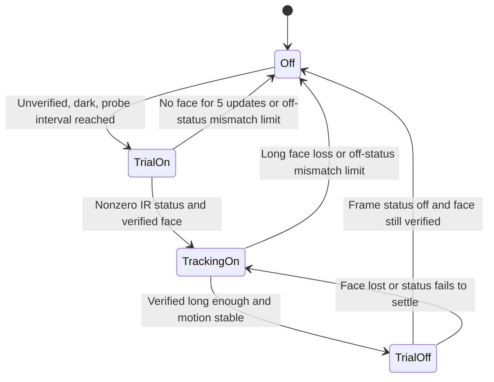

**Off.** A verified face bypasses probing: illumination is unnecessary. For an unverified face, the wait count advances before checking lux. Bright conditions therefore accumulate wait without turning IR on. In darkness, a force condition or sufficiently large gyro change resets the probe interval to 1. Once the interval is reached, policy requests on and enters TrialOn. It increases the next probe interval to $\min(90,\mathrm{trunc}(1.5(n+1)))$ and resets the relevant counters.

**TrialOn.** Frame status zero increments the mismatch counter; four such updates return to Off. Any nonzero status, including transition status 50, clears that mismatch. A verified frame enters TrackingOn, resets the motion estimates to their stability thresholds and restores the basic probe interval. Five unverified updates with nonzero status return to Off.

**TrackingOn.** Status zero advances only the mismatch handling, pausing the ordinary verified/lost counts. With nonzero status, a verified frame increments the verified count and clears the lost count. Once both motion estimates are stable and enough verified updates have accumulated, policy enters TrialOff and requests off. It grows the next trial interval by the same $1.5(n+1)$ rule, capped at 1800. Unverified frames reset the verified count and increment loss; the configured long loss limit returns to Off.

**TrialOff.** A frame reporting IR off resolves the experiment immediately: keep Off if the face is verified, otherwise return to TrackingOn. An unverified frame with transition status below 100 also returns to TrackingOn. Remaining unresolved statuses eventually return to TrackingOn after four mismatch updates.

Policy reset chooses TrackingOn for a nonzero requested state and Off for zero, clears counters and motion-validity flags, and restores base intervals. Stored previous midpoint/gyro bytes can remain, but their validity is cleared.

### Applying a queued request at vsync

The automatic queue stores 100 for on, 0 for off and −1 for no pending request. Hardware-control ownership suppresses queue writes. At an eligible vsync, with neither hardware control nor camera-busy ownership active, the backend:

1. Copies its previous status into the frame-metadata status.
2. Checks for a pending request.
3. If the previous status is 50, or already equals the request, installs the requested stable status and clears the queue.
4. Otherwise sends the camera enable/disable command and sets previous status to 50.

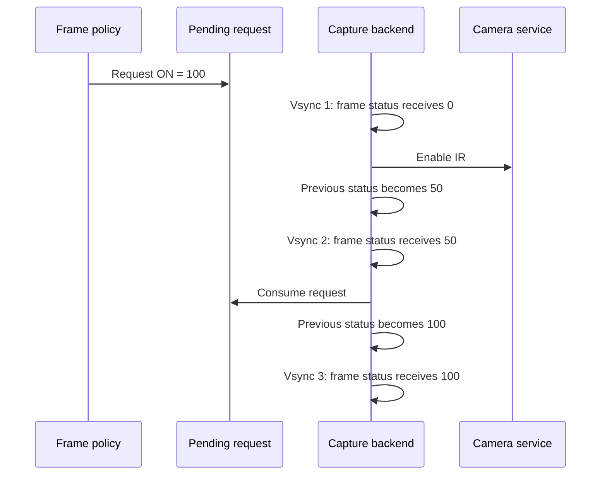

This is software bookkeeping, not a camera acknowledgment protocol. The immediate camera result does not control that status sequence. Vsync notifications can also coalesce, so three metadata stages do not promise three separately processed images.

If the requested direction reverses while previous status is 50, the next eligible vsync can install the new requested metadata state without issuing a second camera command. Software status must therefore not be treated as direct measurement of LED hardware.

### IPC ownership and immediate commands

Common commands 3 and 4 enable/disable user IR ownership. This permission is global, not tied to the session or service that enabled it; another eligible service session can subsequently set or release it. On the transition into ownership, command 3 first sets the ownership flag, attempts an immediate off request, resets policy to Off and returns success. Command 4 attempts off while the ownership flag is still set, resets policy, then clears ownership. Repeating either command in its already-achieved state is a no-op. Their success response does not guarantee that an off command was sent or accepted.

The direct command paths have different gates:

| Path | Ownership requirement | Busy handling |
| --- | --- | --- |
| User IR, command 5 | User ownership must equal 1 | Busy rejects |
| System IR, command `0x407` | User ownership must be 0 | Hardware-control ownership can bypass busy |
| Hardware-control IR, command 5 on `qtm:c` | Hardware-control service initialized | Uses the common system-style gate |

All require applicable runtime availability. A denied camera call maps to `0xC8A18005`, busy to `0xC8A18008`, and unavailable runtime to `0xC8A18009`. Nonnegative camera results are normalized to success in these wrappers.

Immediate setters load the low request byte as signed and eventually forward its low byte without boolean normalization. Thus ordinary 0/1 arguments behave as expected, but forwarding `0xFF` does not establish how the external camera service interprets it.

The camera IPC header is `0x003A0080`. The selector and enable value replace only the low byte of their parameter words, retaining the upper bytes. A negative transport result propagates at the camera-wrapper level; otherwise the camera response result is used before outer mapping.

Hardware-control initialization/finalization changes ownership state, but does not itself reset policy, clear the auto queue or synchronize LED status. Reinitialization yields `0xD82183F9`; operations requiring missing initialization yield `0xD82183F8`.

### Manual commands do not cancel queued automatic work

An important ordinary sequence is:

1. Automatic policy queues ON.
2. A client enables user ownership, which attempts immediate OFF and resets policy.
3. The queued ON remains present.
4. At the next otherwise eligible vsync, the capture backend can apply ON even though user ownership is now set.

The capture queue gate checks hardware ownership and camera-busy state, not user ownership. This is a serial handoff property; it does not require a race. Likewise, the system IR command is an immediate action, not a persistent “system override” that automatically disables future policy decisions.

<a id="ipc"></a>
## 16. IPC commands and public tracking coordinates

QTM exposes ordinary user, system and special services plus a separate hardware-control service. Dispatch selects the upper sixteen bits of the command header. The handlers do not themselves fully validate all lower header bits; this statement does not describe validation performed elsewhere in the system.

### Command surface

| Services | Command | Behavior |
| --- | --- | --- |
| `qtm:u`, `qtm:s`, `qtm:sp` | `0x1` | GetDetectionData, 48-byte record, requested timestamp |
| Same | `0x2` | GetTrackingData, 64-byte record, requested timestamp |
| Same | `0x3`, `0x4` | Enable/disable user IR ownership |
| Same | `0x5` | User IR command |
| Same | `0x6` | Query QTM blacklist state |
| `qtm:s`, `qtm:sp` | `0x401` | Set barrier center, strict range 0–13 |
| Same | `0x402` | Supply ambient lux |
| Same | `0x403`, `0x404` | Enable/disable automatic barrier control |
| Same | `0x405`, `0x406` | Set/get stored barrier phase; setter accepts low-byte phases 0–11 |
| Same | `0x407` | System IR command |
| Same | `0x408` | Set six-float calibration, optionally persist |
| Same | `0x409`, `0x40A` | Get/set activation state; setter accepts 0, 1 or 2 |
| `qtm:sp` | `0x801` | Notify LCD mode |
| `qtm:sp` | `0x802` | Grant expander power-on permission |
| `qtm:sp` | `0x803` | Query expander activation |
| `qtm:sp` | `0x804` | Notify preparation for expander power-off |
| `qtm:c` | `0x1`, `0x2` | Initialize/finalize hardware-control ownership |
| `qtm:c` | `0x3`, `0x4` | Write expander word/query connection |
| `qtm:c` | `0x5` | Hardware-control IR command |

The power-off-preparation notification changes a flag; it is not an immediate synchronous shutdown of every output path.

### End-to-end getter path

A tracking-data request goes from service dispatch to a runtime getter, then to the stable-history requested-time predictor described earlier, then through an output formatter. The predictor's error estimate is discarded by the public getters; an auxiliary output is set to zero. This error is not substituted for the camera confidence field.

GetDetectionData keeps its metadata lock through prediction. GetTrackingData copies metadata and releases the lock before prediction. In both cases, the eye positions may represent a requested prediction horizon while flags, confidence, gyro metadata and timestamp describe a camera-frame publication. They are not newly measured metadata for the requested future time.

### The 48-byte detection record

| Offset | Contents |
| --- | --- |
| `0x00`–`0x02` | Flow flag, verified flag, delayed-validity flag |
| `0x03` | Unspecified/padding byte |
| `0x04` | Copied word whose complete public meaning is unresolved |
| `0x08` | Camera temporal confidence |
| `0x0C` | Left predicted pixel-like coordinate, two floats |
| `0x14` | Right predicted pixel-like coordinate, two floats |
| `0x1C` | Three gyro angles in radians |
| `0x28` | Camera timestamp, 64 bits |

“Detection” or “raw” in an API name should not be read as direct unmodified landmark pixels. Let $(x,y)$ be the predictor's internal normalized eye before its final tangent/sign conversion. The pixel-like formatter produces

```math
p_x=\frac W2+\big(t_x^{-1}(xt_x)\big)\frac W2,\qquad
p_y=\frac H2+\big(t_y^{-1}(-yt_y)\big)\frac W2.
```

The formatter multiplies tangent outputs by the tracker’s reciprocal tangent scales. Ignoring floating-point rounding, this simplifies to $p_x=W(1+x)/2$ and $p_y=H/2-Wy/2$. This uses $W,H$, whereas internal normalization uses $W-1,H-1$. At 320 × 240, internal image center $(159.5,119.5)$ therefore maps to public center $(160,120)$. The vertical sign also changes across these representations. These raw-format coordinates are not guaranteed to remain inside the original image bounds.

### The 64-byte tracking record

| Offset | Contents |
| --- | --- |
| `0x00`–`0x02` | Same three flags |
| `0x03` | Untouched padding |
| `0x04` | Bounds-adjustment flag |
| `0x05`–`0x07` | Padding |
| `0x08` | Camera confidence |
| `0x0C`, `0x14` | Left/right planar coordinates |
| `0x1C`, `0x24` | Left/right tangent-like coordinates |
| `0x2C` | Three gyro angles |
| `0x38` | Camera timestamp, 64 bits |

The planar formatter is fixed around 320-pixel-width geometry:

```math
X=(p_x/160-1)g_x,\qquad
Y=(p_y/160-0.75)g_y,
```

using the startup calibration gains. It then considers bounds $X\in[-1,1]$, $Y\in[-0.75,0.75]$. For each axis it computes the correction needed by each eye, chooses the larger absolute correction, with ties favoring the right eye, and translates **both** eyes by that correction. This preserves separation. It is not independent clamping of each eye, and an eye pair wider than the allowed region need not end with both eyes inside it.

The tangent-like fields multiply adjusted planar coordinates by nominal factors approximately 0.6358439326 and 0.4769752622. These fields are neither gaze vectors nor head positions measured in meters.

Unavailable runtime returns `0xC8A183EF`; busy runtime can return `0xC8A18008`. Associated fallback records are zeroed on the applicable error paths. Conversely, a successful getter can return fallback predicted eyes even when the camera is unverified or useful prediction history is absent. Callers must inspect flags/confidence according to their needs rather than treating IPC success as proof of a currently visible face.

<a id="walkthrough"></a>
## 17. A complete tracking/loss/recovery walkthrough

Consider an ordinary startup with a 320 × 240 inner-camera stream, combined prediction mode and automatic IR permitted.

### Finding a face

Capture initializes its three buffers and camera-service events. The gyro reader begins consuming sensor samples independently. The first usable camera image becomes a luminance pyramid. Initialize leads to Acquire, which searches selected regions and scales using LBP. Nearby classifier hits merge into face hypotheses; the selected rectangle supplies approximate eyes. SDM model 0 samples around those eyes and produces a refined pair.

Acquisition starts confidence at 0.5 and proposes Track. The history manager records the camera observation, associates gyro information where possible, and begins filling raw/stable snapshots. Early public queries can still use fallback behavior because the histories needed by their predictor are not yet available.

### Following the face

On the next frames, gyro and image predictors suggest where the eyes should be. Optical flow finds a coherent affine motion of fourteen face-centered patches. Track applies the tag-selected SDM model, combines candidates and applies its row-dependent correction. The verification crop checks whether the resulting eyes still correspond to a face-like image region.

Reliable observations train the small motion filters. Raw snapshots preserve immediate motion estimates; stable snapshots suppress small jitter and provide gentler loss transitions. Gyro samples arriving between camera frames allow the barrier worker to advance an earlier eye estimate without waiting for another picture.

The barrier worker takes its own prediction path, finds the eye midpoint, applies calibration and hysteresis, and publishes one of twelve cyclic phases. The expander worker alternates the corresponding output words when awakened. A client requesting tracking data at the same moment uses stable requested-time prediction and public coordinate conversion, so its returned eye values are not a direct copy of the barrier worker's intermediate eyes.

### Losing visual confidence

Suppose verification fails repeatedly after confidence is 0.5. The next confidence values are approximately 0.35, 0.245 and 0.1715. The third falls below 0.2 and latches loss. Flow validity, visual state and verification need not all change together: a geometrically acceptable flow transform can coexist with a rejected face crop, and a state transition can occur after a history publication.

During loss, motion can support a short Coast period. Stable future-motion knots shrink over ten frames, while fallback anchors supply usable policy positions. Longer fallback operation moves anchors gently toward the center. The barrier path therefore has defined fallback inputs; loss does not mean that every output stops immediately.

If darkness accompanies the unverified face, automatic IR eventually probes on. The camera command and the frame metadata follow the delayed status sequence. A suitable illumination change can also trigger settling, preventing ordinary image-to-image tracking from treating that change as normal face motion.

### Recovering

A new acquisition can set confidence back to 0.5 while the lost latch remains set. Successive verified updates then produce approximately 0.65, 0.755 and 0.8285. The last exceeds 0.8, clears loss and opens the immediate gate. The delayed gate opens after its additional frame delay.

Early reacquisition, if still eligible, can replace eye positions near the reference face without rerunning the whole frame pipeline. This explains how a frame can end with newly selected eyes while retaining a verification result or history entry produced earlier in that frame.

Once illumination is on and the face has remained verified and sufficiently still, the IR policy tries switching it off. If the face remains visible with off-status metadata, policy stays Off. If tracking needs the illumination, it returns to TrackingOn and postpones the next off trial.

<a id="lifecycle"></a>
## 18. Lifecycle, storage and configuration

The ordinary lifecycle connects services, camera ownership, processing workers and the barrier worker. These relationships explain when tracking is available and which state survives a pause or reset.

### Initialization and worker roles

Startup reads the four-byte status/configuration block `0x180000` and calibration block `0x180001`, initializes barrier support and public-coordinate gains, loads models, configures camera capture, constructs gyro/tracker state and starts workers. Production camera configuration selects 320 × 240 packed YUV422 and a nominal 30 FPS mode.

The camera-processing worker has an 80,000-byte stack. The live gyro worker and capture backend each use 4096-byte stacks; the replay variant of the gyro worker uses a larger 80,000-byte stack. Their requested priorities are respectively 16, 15 and 12, with processor selector 3 in the launch requests. A common entry wrapper installs thread-local runtime state and floating-point mode before calling the worker.

Thread creation and runtime publication are distinct events. Startup can wait for the worker to publish readiness without implying that it has already processed a camera frame. Error handling also distinguishes negative Results from positive nonzero status values: unsupported-format returns such as 102 and 114 stop an inner initializer, while some outer callers only reject negative Results. These irregular cases do not describe the ordinary supported camera format.

### Activation states and camera pause

Activation states 0 and 1 can switch without reconstructing the pipeline. State 2 suspends processing: runtime availability changes, stop/abort state is raised, processing workers are joined, camera capture is paused, gyro service use is disabled and the barrier is notified toward its static state.

Resume enables gyro use, restores run/abort state, resumes camera capture, resets/restarts processing and waits for publication of startup readiness. Camera image buffers are retained across this pause/resume sequence.

The capture pause protocol drains the backend, acknowledges the pause and waits for resume. Acknowledgment/resume events have auto-reset semantics; repeated signals can coalesce. Resume resets relevant warmup/restart bookkeeping but retains buffer identities, ready-frame state and IR metadata. The normal ordered protocol is sufficient to understand ordinary tracking availability.

### Reset is not destruction

Tracker reset clears camera-history count, image-frame state, eye/flag fields and relevant counters, and sets confidence to 1. It resets predictor observation state as described earlier. It does **not** erase everything:

| State | Retained by the relevant reset path |
| --- | --- |
| Gyro history | Count and stored samples |
| Raw/stable snapshot histories | Counts and payloads |
| Learned motion equations | Accumulated regression state |
| Models and image buffers | Existing resources/storage |
| Calibration | Current configured values |
| Mode controls | Active/saved mode and pending request as specified by the caller |
| Acquisition override | Persistent signed override |

Resetting pyramid roles does not free their backing storage. A caller that needs construction-equivalent state cannot assume a reset provides it.

### Shutdown ordering

The main process reacts differently to shutdown and other notifications. The terminating notification includes a 100 ms wait; another notification path only signals relevant work. Main shutdown waits for occupied service-session workers before unregistering ports and tearing down runtime objects. Completing one IPC command does not necessarily end the session thread: an open session can remain until disconnection.

Normal destruction stops capture/backend activity, releases image storage, joins remaining processing workers and destroys gyro/camera/tracker support objects in the recovered order. Individual destructor order is not a universal proof against every already-entered worker operation; ordinary synchronized shutdown is the operating assumption here.

The gyro sampler destructor disables the HID gyro through its cursor destructor even if its global instance counter remains positive after decrement. The caller separately frees the object. The counter is therefore not a complete shared-device lifetime protocol by itself.

### Model archive and binary ownership

All seventeen shipped models—eight LBP and nine SDM—come from a 541,401-byte embedded ZIP archive. The reader scans local file headers sequentially and accepts stored, uncompressed entries with matching compressed/uncompressed sizes. Names require equal length and are compared case-insensitively. It does not use the central directory as its lookup index, decompress entries or validate payload CRCs during lookup.

Production startup selects borrowed resources: model objects point into immutable archive storage. An alternate owned-copy mode exists, controlled by one global flag rather than a flag in each model. A resource handle itself is two words, pointer and size.

The loader can strip a leading `<METADATA>` wrapper through an exact `</METADATA>` terminator followed by LF. It is a byte-pattern remover, not an XML parser. The shipped LBP payloads begin directly with binary headers.

LBP setup checks the `LBP` prefix, version 13 and a bounded low-word product of canonical dimensions before computing scale parameters. It is not a complete validation of every internal bytecode offset. Replacement becomes destructive once binary-model validation starts: a later rejection need not preserve the previous model. The fixed supplied archive satisfies the ordinary loader's requirements.

### Image and detector scratch storage

Image objects keep dimensions, stride and ownership separately. Some views borrow another object's backing buffer; owner identity distinguishes those from allocations that must be released. The eight LBP runtime objects share two scratch buffers for integral/resampled images. Pyramid levels and verification crops have their own size/stride requirements.

A buffer's dimensions do not imply that every row is tightly packed. Algorithms must respect the actual stride and distinguish a borrowed view from its owner. Model/scratch lifetime is relevant to an exact port, but allocator implementation is outside this guide's focus.

### Optional accelerometer, replay and pending configuration

The production initialization path supplies no accelerometer source to the gyro sampler. An optional path nevertheless exists. It reads the newest value from an eight-slot HID acceleration ring with fresh local cursors, applies a deadband and Q7 gain, optional signed-short zero-offset/affine calibration, then converts using exactly $1/512$ to acceleration in g.

For a raw axis $r$, previous filtered value $p$, deadband $d$ and Q7 gain $g$, the filter retains $p$ inside the deadband. Outside it,

```math
p'=\mathrm{int16}\left(p+\frac{(r-p-\mathrm{sign}(r-p)d)g}{128}\right),
```

where the actual division is an arithmetic shift and final conversion wraps. Calibration likewise truncates/wraps rather than saturating.

After a nonempty gyro batch, enabled acceleration correction accepts magnitudes strictly inside a tolerance band around 1 g. A triangular magnitude trust, squared and scaled, controls how much the orientation matrix is rotated toward gravity. It then repairs matrix rows and returns the chord length between old and target directions. That scalar is a correction magnitude, not confidence. This optional branch changes the orientation matrix, not angular rates or cumulative turns used by head tracking. Parallel/antiparallel alignment has an identity fallback rather than a special 180-degree construction.

Replay/logging support and auxiliary gyro caches are present but are not required by the normal live path. Likewise, the capture backend implements a pending-FPS-change branch that repeats much of camera configuration while retaining key buffer/warmup state. A normal producer of that pending flag has not been established. The odd-SDM-variant override has a similar producer-reachability limitation.

<a id="implementation"></a>
## 19. Numerical behavior, structures and function map

The equations explain QTM's behavior, but exact reproduction also depends on representation and operation order. This chapter collects details that do not fit naturally into the conceptual pipeline.

### Floating-point environment and constants

The worker entry sets FPSCR to `0x03000000`: flush-to-zero for subnormal arithmetic, default-NaN behavior and round-to-nearest arithmetic. Copying raw words can preserve a subnormal or unusual NaN bit pattern even when subsequent floating arithmetic changes it.

Legacy ARM VFP multiply-accumulate instructions round multiplication and accumulation separately. They are not modern fused multiply-adds. `FNMACS` in the relevant sequences means subtract the product from the accumulator. Algebraic rearrangement, host double precision or a compiler's fused operations can change low bits and threshold decisions.

| Quantity | Exact stored representation or convention |
| --- | --- |
| Degrees to radians | Float bits `0x3C8EFA35` |
| Turns to radians | Float bits `0x40C90FDB` |
| Gyro angle clamp magnitude | Float bits `0x3FC90FDB` |
| Gyro rotation coefficient near $2/\pi$ | Float bits `0x3F22F983` |
| SDM features | Signed integer, scale $2^{13}$ |
| Pyramid-sampler intensities | Q16 fixed point |
| Optical-flow interpolation fractions | Q7 |
| Optical-flow intensity/gradient storage | Q5 signed shorts |
| Integral images | Modulo-$2^{16}$ sums |
| Timestamp comparisons | Usually low-word differences interpreted as signed or unsigned at the particular caller |

Different rounding operations coexist: ordinary arithmetic rounds nearest/even; several explicit coordinate/calibration helpers round ties away from zero; integer conversions truncate or saturate according to the specific instruction/helper. They should not all be replaced by one host-language `round` function.

### Nonfinite numbers and partial recovery

Existing exceptional-number behavior is useful to know even when ordinary operation uses finite calibration and valid images:

- Float-to-signed-integer conversion maps NaN to zero and infinities to the signed endpoints in the phase path. After positive modulo 12, NaN, positive infinity and negative infinity select indices 0, 7 and 4 respectively. They do not select the transparent preset automatically.
- Under worker flush-to-zero, subnormal FOV values can behave like zero at the barrier setter. NaN and infinity can pass its zero check and propagate into derived coefficients.
- Gyro point admission rejects ordered absolute coordinates at least 10 and infinities, but its unordered comparisons can admit NaNs. Angle clamps then map NaN differences to zero; final coordinate clamps map NaNs to zero and infinities to finite bounds. A finite published point therefore does not prove finite retained state.
- Requested-time delay conversion has two paths: a software unsigned-64-bit conversion for gyro delay and signed VFP conversion for image delay. Negative/NaN values, saturation and low-word truncation consequently differ. Horizon clamps can preserve NaN rather than choosing an ordinary endpoint.
- Snapshot interpolation has no universal “zero weight means do not evaluate the other endpoint” shortcut. A zero times infinity can still produce NaN.
- Predictor validity bits are not finite-number checks. NaN residuals can set an error average to 1 through signed bit comparisons while still preventing adaptation; positive infinity can instead allow adaptation that contaminates learned equations.
- A filter reset can temporarily restore finite fallback output while leaving nonfinite learned equations intact. Later adaptation can reintroduce nonfinite coefficients. Construction replaces more state than reset.
- Explicitly zeroing lost-state prediction knots after ten frames does not necessarily repair NaN eye positions retained by the separate smoother.

The orientation-matrix repair also has no general zero-norm guard or iteration cap. Degenerate or inverted matrices need not become valid rotation matrices. Its ordinary nondegenerate behavior should not be mistaken for an unconditional repair guarantee.

Trigonometric helpers contain small-input fast paths and range reduction. Raw tiny values can survive a fast-path return and then flush in later arithmetic. Infinite arguments and NaNs also have distinct error/propagation behavior. These details matter for faithful numerical behavior, while their normal hardware reachability remains a separate question.

### Principal object and record sizes

| Object | Size | Notes |
| --- | ---: | --- |
| Tracker | 5944 bytes | Contains detector, filters, histories and state |
| Detector overlay | 620 bytes | Includes the illumination-selection tail; older 616-byte view stopped before it |
| Gyro sampler | 5312 bytes | Raw histories, calibration, integrated record and optional support |
| IR policy | 124 bytes | Settings, four-state policy, counters and motion history |
| Barrier manager | 76 bytes | Parsed calibration, derived coefficients and hysteresis |
| Image motion filter | 136 bytes | Three vector observations and two-free-parameter regression |
| Gyro motion filter | 152 bytes | Three-component counterpart |
| LBP header / runtime model | 56 / 64 bytes | Binary format versus loaded resource/scratch object |
| SDM header / stage | 44 / 44 bytes | File-relative tables |
| Image level / pyramid | 28 / 480 bytes | Strided buffers and level metadata |
| Face hypothesis | 52 bytes | Rectangle, weight and eight tags |
| Eye candidate | 28 bytes | Two eyes, weight, validity and trust |
| Prediction snapshot | 96 bytes | Eye pair, three knots, epoch and gyro anchor |

All pointer-bearing sizes refer to the 32-bit target, not native structures compiled unchanged on a 64-bit host.

### Useful tracker offsets

Offsets below are decimal from the tracker base. Unknown ranges remain intentionally unspecified.

| Offset | Field or group |
| ---: | --- |
| 0 | Vtable |
| 4 | Barrier-output pixel eye pair |
| 20 | Output-state word with unresolved complete meaning |
| 24 | Image dimensions |
| 32 | Policy eye pair |
| 48–51 | Verified, flow-valid, immediate gate, delayed gate bytes |
| 52 / 56 / 64 | Confidence / camera tick / camera-aligned gyro angles |
| 144 / 148 | Acquisition override / active prediction mode |
| 160 / 168 | Tick frequency / nominal frame interval |
| 176 / 192 / 208 | Measured eyes / previous eyes / normalized anchors |
| 224–843 | Detector including illumination-selection tail |
| 864 / 880 | Search rectangle / acquisition scan phase |
| 884 / 916 | Eight smoothed tags / classifier resume token |
| 920 / 924 / 928 | Frames since acquisition / epoch / reacquisition region cursor |
| 932 / 936 | SDM index / nine model-handle pairs |
| 1008 / 1012 / 1016 | Flow-error EMA / odd-SDM override / previous IR status |
| 1020 / 1500 | Alternating pyramid objects |
| 1980 / 1984 / 1988 | Current/previous pyramid pointers / maximum pixel coordinates |
| 1996 / 2000 / 2004 | Frame index / inverse height / smoothed frame interval |
| 2008 | Saved prediction mode |
| 2012 / 2148 / 2284 | Raw motion filters / gyro motion filter |
| 2436 / 2440 | Smoothing/prediction thresholds |
| 2444 / 2580 | Stable motion filters |
| 2716 / 2720 | Reliable/fallback frame runs |
| 2724–2736 | Public-history delay and envelope state |
| 2744 / 2752 / 2760 | Tangent scales / reciprocals / smoothed gyro interval |
| 2788 / 2796 / 3076 | Gyro-axis projection / camera ring / camera count |
| 3080 / 4104 / 4108 | Gyro ring / index / count |
| 4112 / 4880 / 4884 | Raw snapshot ring / index / count |
| 4888 / 5656 / 5660 | Stable snapshot ring / index / count |
| 5760 / 5764 / 5768 | Projection angle / confidence alpha / reacquisition duration |
| 5772 / 5776 | Upper/lower confidence thresholds |
| 5780 | Prediction lock |
| 5792 / 5793 / 5796 | Image state / lost latch / reset request |
| 5800 / 5804 / 5808 | Coast count / settle count / three eye candidates |

The prediction lock at 5780 is not the same object as the mutex in the tracker's tail near 5940. Other opaque buffers and ranges remain present; assigning names to surrounding fields does not establish their contents.

### Main entry points in this image

| Address | Descriptive function / purpose |
| --- | --- |
| `0x100C60` | Startup configuration and barrier support |
| `0x103464` / `0x1035C4` / `0x1039F8` | User/system/special IPC dispatchers |
| `0x104898` | Final phase quantization/publication |
| `0x1054FC` | Rebuild barrier calibration coefficients |
| `0x105F40` | Set tracker horizontal FOV |
| `0x1073BC` | Apply live calibration to runtime consumers |
| `0x108590` | Read stable HID gyro ring |
| `0x109348` | Find embedded model resource |
| `0x109A64` | Dispatch a camera frame to the tracker |
| `0x109D18` | Complete YUV-frame processing |
| `0x10B3C0` / `0x10B4BC` | Public pixel/tangent prediction wrappers |
| `0x10BDB0` | Ingest gyro samples into tracker histories |
| `0x10DEB0` | Reset tracker |
| `0x10EF84` / `0x110EB4` | Gyro increment projection / image-motion integration |
| `0x112394` | IR command without user-control ownership |
| `0x1134D4` | Calibration transaction |
| `0x1136AC` / `0x113738` / `0x11378C` | User IR setter / disable / enable ownership |
| `0x113E38` | Read calibrated gyro records |
| `0x115F90` | Barrier eye predictor |
| `0x117624` / `0x117748` | Eye midpoint to phase / barrier calibration setter |
| `0x118DE0` / `0x119BF4` | Immediate camera IR method / camera IPC wrapper |
| `0x119154` | Process and publish a camera frame |
| `0x11B888` | Refine eye positions using SDM |

The tracker vtable at `0x1EB62E44` begins with frame processing, gyro ingestion, barrier prediction, reset, public tangent prediction and public pixel prediction at byte slots 0, 4, 8, 12, 16 and 20. The FOV setter occupies slot 44. Runtime heap pointers from the captured image are not stable external identifiers.

<a id="verification"></a>
## 20. Reverse-engineering and verification

This section contains the investigation methodology, test procedures, evidence references and remaining limits. The preceding chapters describe recovered behavior; this section explains the basis and scope of those claims.

### Method: connect producers, consumers and original instructions

The investigation began with the supplied IDA database and its process-memory contents. It followed the ordinary path from configuration and camera capture through image algorithms, state/history updates, prediction, barrier publication and IPC. The working method was:

1. Read decompiler output and identify a function's callers, callees and data accesses.
2. Follow important fields back to constructors/setters and forward to consumers, rather than assigning meaning from one use or an old comment.
3. Inspect ARM/VFP instructions wherever decompilation obscured comparisons, arithmetic, aliasing, ABI details or call order.
4. Recover binary layouts and embedded models, retaining unknown padding instead of inventing fields.
5. Rename functions/locals, improve pointer/array/argument types and annotate the database with established semantics and qualifications.
6. Build independent executable references and compare them with extracted original ARM instructions.
7. Connect previously isolated routines through their original callers, then carry state through multi-frame and IPC sequences.

Later instruction and caller analyses supersede earlier provisional interpretations. Material corrections include the startup-calibrated public gains, the live 25 ms camera timestamp offset, the public/barrier prediction split, the unwrapped phase hysteresis and static-mode phase overwrite, the actual IR queue handoff, and unordered floating-point comparisons. This guide uses those later resolutions rather than mechanically concatenating chronological notes.

No executable QTM instructions were patched as part of the database readability work. Analysis declarations such as `volatile` on captured gain globals prevent misleading decompiler constant propagation; they do not establish qualifiers from the original source code.

### Why the decompiler alone was insufficient

Several recurring artifacts required instruction-level resolution:

| Artifact | Consequence if accepted literally |
| --- | --- |
| Captured global values propagated as constants | Runtime calibration gains mistaken for universal hardcoded numbers |
| Incorrect rendering of legacy `FNMACS` | Wrong determinant, orientation or subtraction equations |
| Post-SVC R0 confused with its pre-SVC handle value | Wrong transport-error handling |
| Missing 64-bit argument alignment | Extra fictitious argument in public prediction calls |
| Hard-float return in S0 overlooked | Correction magnitude mistaken for an incidental pointer return |
| Omitted conditional identity comparisons | Incomplete affine identity checks |
| Rounded decimal literals | Threshold/phase differences near boundaries |
| Combined words or overlarge stack arrays | Wrong IR boolean expressions or output/scratch layouts |
| Signed integer comparisons of float bit patterns | Incorrect assumptions about NaN or threshold behavior |

Where pseudocode remains misleading, original instructions and connected behavior are authoritative. Correcting a prototype does not necessarily eliminate every Hex-Rays artifact.

### Independent references and original-ARM execution

The executable references are Python implementations that preserve required binary32 rounding, signed/unsigned widths, shifts, wraparound, operation order and target conversions. The harnesses execute captured original ARM code in Unicorn, with its required literal pools, model bytes and numerical callees mapped at their target addresses.

The comparison boundary varies by harness and is stated in its report. Ordinary algorithm harnesses retain original nested image/math/history code. Supplied boundaries include system time, TLS, locks/events, successful allocations, kernel calls and external service replies. Some early control-path fixtures deliberately supply a nested result to force a branch; later full-kernel or full-frame suites execute the nested computation itself. Those are different levels of evidence and are not silently combined into a claim that every forced branch arose naturally from camera pixels.

Checks go beyond returned eye coordinates. Depending on the routine, they compare:

- All 5944 tracker bytes, full sampler/policy/manager objects and selected global regions.
- Every relevant pyramid, crop, integral-image or sampled-intensity byte.
- Float output bits, unchanged inputs, untouched padding and surrounding memory guards.
- Ring indices/counts, partial writes and retained state after errors or reset.
- Nested call arguments/order, IPC headers, outgoing payload bytes and response Results.
- Persistent state after each frame, sensor batch, ownership change or calibration transaction.

Whole-object comparison catches differences hidden by a finite or apparently correct final eye pair. In particular, retained nonfinite regression state can be masked temporarily by fallback or output clamps.

Later numerical suites execute the real worker floating-point initializer and preserve FPSCR `0x03000000`, including flush-to-zero/default-NaN behavior. Earlier ordinary finite suites remain useful, but their arithmetic environment and input domain should not be broadened retrospectively.

### Coverage and retained reports

The following table summarizes representative completed suites. Counts denote the categories stated by each report. Nested calls, repeated integration fixtures and later reruns are **not** a disjoint global test total.

NOTE: I removed these files from this cleaned-up repo as they would clobber it.

| Area | Recorded scope | Retained report |
| --- | --- | --- |
| LBP features, VM and selector | 10,816 feature comparisons, 192 shipped-model VM calls, 1,476 synthetic-program calls and 1,899 selector comparisons | [LBP execution](evidence/lbp-arm-validation.json) |
| SDM | 725 calls; all nine shipped models; 180 executed stages and 18,311 nested sampler calls | [SDM refinement](evidence/sdm-refinement-arm-validation.json) |
| Optical-flow kernel | 296 direct kernel calls, plus 108 kernel invocations through original scheduling/geometry callers | [Optical-flow kernel](evidence/optical-flow-kernel-arm-validation.json) |
| Prediction snapshots/history | 1,444 direct calls across evaluation, smoothing, insertion and construction | [Prediction history](evidence/prediction-history-arm-validation.json) |
| Adaptive filters/history manager | 2,411 direct calls, including persistent manager updates | [Adaptive motion](evidence/adaptive-motion-arm-validation.json) |
| Requested-time and gyro ingestion | 2,241 direct calls, including a persistent connected prediction sequence | [Requested prediction](evidence/requested-prediction-arm-validation.json) |
| Full image-frame pipeline | 114 complete YUV frames with original image/prediction callees | [Full frames](evidence/full-frame-arm-validation.json) |
| Barrier integration | 3,519 calls/slices, plus 43 YUV frames connected through prediction/publication/output selection | [Barrier integration](evidence/barrier-integration-arm-validation.json) |
| Live calibration | 3,456 complete transactions and 92 additional CFG lifetime calls | [Calibration transaction](evidence/calibration-transaction-arm-validation.json) |
| Automatic IR | 5,045 policy, queue, gate and connected feedback calls/slices | [IR policy](evidence/ir-policy-arm-validation.json) |
| Exceptional calibration/barrier numbers | 11,406 calls/slices across trigonometry, conversion, calibration and output publication | [Exceptional barrier numbers](evidence/barrier-exceptional-arm-validation.json) |
| Exceptional gyro/barrier prediction | 5,086 comparisons under worker floating-point mode | [Exceptional gyro history](evidence/prediction-exceptional-arm-validation.json) |
| Exceptional public prediction | 7,299 comparisons | [Exceptional requested prediction](evidence/requested-exceptional-arm-validation.json) |
| Exceptional snapshot production | 6,494 comparisons | [Exceptional snapshots](evidence/snapshot-builder-exceptional-arm-validation.json) |
| Exceptional motion-history manager | 7,822 comparisons, including 576 persistent manager/API/barrier frames | [Exceptional motion history](evidence/motion-history-exceptional-arm-validation.json) |
| Shared camera/gyro processing | 12 schedules, 216 complete camera frames, 183 gyro iterations and 171 barrier predictions/publications | [Combined workers](evidence/combined-camera-gyro-arm-validation.json) |
| Configuration transitions | 348 direct setter/reset calls, 168 startup-caller slices with resets, 154 complete frames | [Tracker configuration](evidence/tracker-configuration-arm-validation.json) |
| Public coordinates/IPC | 24 complete frames followed by 96 IPC queries; separate 72-request dispatch matrix, 24 getters and four live-calibration/query pairs | [Public output](evidence/public-tracking-output-arm-validation.json) |
| Connected IR IPC | 179 direct calls/slices, including 160 IPC requests, six policy updates and thirteen vsync slices; 60 nested camera requests | [IR IPC](evidence/ir-ipc-arm-validation.json) |

Additional retained suites cover LBP features/VM, model selection, search/merging, region/scale scheduling, pyramid construction, ordinary gyro calibration/filtering/orientation, optional acceleration, capture ownership, initialization, pause/resume and teardown. The source index below identifies those analyses and their harness links.

Positive image-pipeline fixtures use controlled synthetic LBP programs to produce deterministic detections, together with shipped SDM models. Stock LBP resources also receive direct feature/VM and negative-frame coverage. This does **not** amount to demonstrating positive-face accuracy on recorded camera images using the complete stock classifier set.

The connected IR suite executes each actual QTM dispatcher, ownership/availability checks, camera virtual method and original camera request builder, with a supplied SVC boundary. Its persistent serial sequences establish queue retention across manual ownership and hardware-control transitions. They end at the defined post-IR camera-worker slice boundary; they do not measure electrical LED timing.

### Reproducing the software checks

The repository retains reference scripts, verifier scripts, code/data captures and JSON result reports. From the repository root, with Python and Unicorn 2.1.4 available, representative commands are:

NOTE: I removed these files from this cleaned-up repo as they would clobber it.

```sh
PYTHONDONTWRITEBYTECODE=1 PYTHONPATH=RE python3 RE/verify_ir_policy_arm.py
PYTHONDONTWRITEBYTECODE=1 PYTHONPATH=RE python3 RE/verify_ir_ipc_arm.py
PYTHONDONTWRITEBYTECODE=1 PYTHONPATH=RE python3 RE/verify_public_tracking_output_arm.py
PYTHONDONTWRITEBYTECODE=1 PYTHONPATH=RE python3 RE/verify_combined_camera_gyro_arm.py
```

A locally installed dependency directory may also need to be added to `PYTHONPATH`. Unicorn requires executable-memory permission; a sandbox denying that permission can prevent initialization before any comparison runs. These commands use local captured code and supplied OS/service boundaries, not a console or network service.

This consolidation summarizes retained results; creating this document did not rerun every historical ARM suite. Document checks separately cover its links, section anchors, code/math delimiters and required terminology exclusions.

The two illustrative VM programs in [the worked examples](#vm-examples) were encoded with the documented record layouts and run through the existing independent Python reference. Checks confirmed feature code 127, instruction offsets, the accepted record, early-acceptance IDs, the two-call token sequence and capacity-two traversal. These are checks of the explanatory examples, not additional original-ARM comparisons or recognition-accuracy results.

### Confidence, interpretations and remaining limits

The ordinary software chain from camera pixels and HID samples through tracking/history, both predictors, calibration, barrier publication, public getter serialization and connected IR ownership is substantially recovered. The evidence supports the described state transitions, data layouts and arithmetic under the stated fixtures.

Some interpretations remain deliberately narrower:

| Established from software | Interpretation or external question |
| --- | --- |
| Row-dependent correction proportional to image Y and midpoint motion | Likely exposure/readout compensation; physical timing association not measured |
| Distance/IOD parameters 301 and 62 with a ratio in phase gain | Millimeters are plausible, but not tagged units in the binary |
| Camera configuration requests a nominal 30 FPS mode | Actual exposure cadence, missed frames and end-to-end latency require hardware observation |
| Software IR statuses 0/50/100 and command order | Actual illumination timing and camera acknowledgment are not measured by those statuses |
| Gyro count conversion and projected-axis equations | Physical console-axis directions/signs require an external orientation experiment |
| Fixed LBP/SDM models and tag-dependent selection | Training data, training procedure, vendor provenance and precise semantic labels are not recovered |
| Output words and thirteen driven expander bits | Full panel wiring and optical behavior are not reconstructed from those words alone |

Useful remaining algorithm-facing work includes identifying normal producers of the pending-FPS flag, optional SDM override and auxiliary gyro-cache cursors; clarifying opaque fields/buffers; and evaluating stock-model accuracy on real positive-face recordings. Optional replay/logging and every peripheral IPC/configuration producer are not exhaustively mapped merely because their central consumers are understood.

Heap implementation, new allocation-failure campaigns, arbitrary synchronization failures and fringe lifecycle races remain outside the requested focus. Earlier notes contain bounded investigations of some such cases; those do not justify claiming comprehensive concurrency or malformed-input safety. The current guide assumes ordinary successful synchronization where appropriate.

### Source-note index

The guide is self-contained for its end-to-end explanation. These local sources preserve finer instruction listings, chronological corrections, harness entry points and database annotation manifests. A historical note's “remaining work” paragraph may have been superseded by a later source in the same row.

NOTE: I removed these files in the cleaned-up repo.

| Topic | Source notes |
| --- | --- |
| Architecture and output | [01 Architecture](01-architecture.md), [02 Barrier hardware](02-barrier-hardware.md), [03 Calibration](03-calibration-phase.md), [39 Barrier integration](39-prediction-to-barrier-integration.md), [40 Live calibration](40-live-calibration-transaction.md) |
| Visual state and frame entry | [04 Tracker states](04-tracker-states.md), [20 Verification feedback](20-tracker-verification-feedback.md), [28 Candidates/fusion](28-tracker-candidates-and-fusion.md), [32 Reset/frame entry](32-reset-and-frame-entry.md), [33 Complete frames](33-complete-frame-integration.md), [59 Configuration](59-tracker-configuration-and-mode-transitions.md) |
| Vision fundamentals and model formats | [06 Image algorithms](06-image-algorithms.md), [13 SDM format](13-sdm-model-format.md), [14 LBP VM](14-lbp-model-and-vm.md), [15 Model selection](15-runtime-model-selection.md), [23 Model lifecycle](23-model-lifecycle.md), [24 SDM refinement](24-sdm-refinement.md) |
| Detection and geometry | [16 Merging/crops](16-candidate-merge-and-affine-crops.md), [17 Search/fractional pyramid](17-detector-search-and-fractional-pyramid.md), [18 Scale scheduler](18-multiscale-scheduler.md), [19 Affine fitting](19-affine-fit-and-verification.md), [21 Reacquisition](21-early-reacquisition.md), [22 Acquisition](22-ordinary-acquisition.md) |
| Images and optical flow | [25 Pyramid construction](25-pyramid-construction.md), [26 Flow control](26-optical-flow-control.md), [27 Flow kernel](27-optical-flow-kernel.md), [34 Scratch lifetime](34-detector-scratch-lifetime.md), [36 Frame scratch](36-frame-scratch-failures.md) |
| Prediction and learning | [05 Gyro prediction](05-gyro-prediction.md), [12 Adaptive filters](12-adaptive-filters.md), [29 Snapshots](29-history-and-prediction-snapshots.md), [30 History manager](30-adaptation-and-history-manager.md), [31 Requested-time prediction](31-requested-time-and-gyro-ingestion.md) |
| Sensors | [41 Gyro sampler](41-gyro-sampler-filter-and-orientation.md), [42 Calibration/HID](42-gyro-calibration-startup-and-hid-ring.md), [43 Optional acceleration](43-accelerometer-correction-and-sampler-lifetime.md), [55 Live gyro worker](55-connected-live-gyro-worker.md) |
| Camera and workers | [07 Camera/IR](07-camera-ir.md), [44 Worker control](44-camera-and-gyro-worker-control.md), [45 Capture ownership](45-camera-capture-ownership.md), [47 Camera initialization/FPS](47-camera-initialization-and-fps.md), [48 Worker startup](48-worker-creation-and-startup-failures.md), [58 Combined workers](58-combined-camera-and-gyro-processing.md) |
| Lifecycle | [35 Tracker teardown](35-tracker-teardown.md), [46 Pipeline shutdown](46-pipeline-lifetime-and-shutdown.md), [56 Pause acknowledgment](56-camera-pause-acknowledgment.md), [57 Activation/session callers](57-activation-session-and-shutdown-callers.md) |
| Services, public coordinates and IR | [08 Services](08-services.md), [37 Automatic IR](37-ir-policy-and-camera-handoff.md), [60 Public coordinates](60-public-tracking-coordinates-and-calibration.md), [61 Connected IR IPC](61-ir-ipc-and-automatic-handoffs.md) |
| Exceptional numerical behavior | [49 Calibration/barrier numbers](49-exceptional-calibration-and-barrier-numbers.md), [50 Worker floating-point mode](50-worker-mode-frames-and-exceptional-gyro.md), [51 Gyro/barrier numerics](51-exceptional-gyro-ingestion-and-barrier-prediction.md), [52 Public prediction numerics](52-exceptional-requested-time-prediction.md), [53 Snapshot numerics](53-exceptional-snapshot-production.md), [54 History numerics](54-exceptional-camera-motion-history.md) |
| Investigation records | [Validation ledger](11-validation.md), [Continuation ledger](38-offline-continuation-plan.md), [Database map](09-database-map.md), [Function map](function-map.md), [Evidence index](evidence/README.md) |
